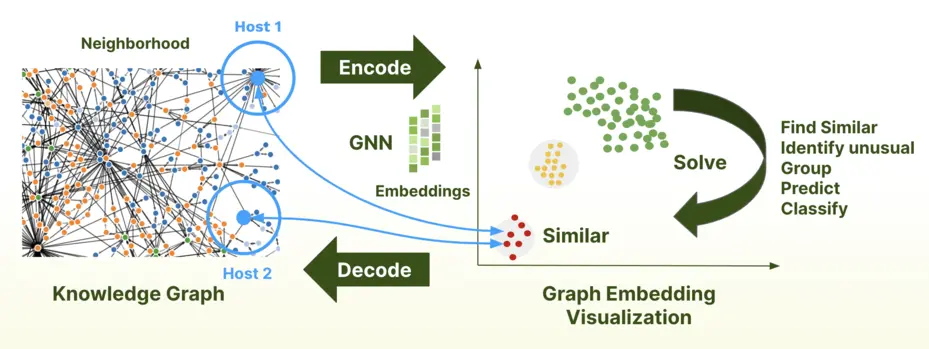

Traditional Machine Learning (ML) overlooks the connections and relationships
between data points, which is where graph machine learning excels. However,
accessibility to GraphML has been limited to sizable enterprises equipped with
specialized teams of data scientists. ArangoGraphML simplifies the utilization of GraphML,
enabling a broader range of personas to extract profound insights from their data.

## How GraphML works

Graph machine learning leverages the inherent structure of graph data, where
entities (nodes) and their relationships (edges) form a network. Unlike
traditional ML, which primarily operates on tabular data, GraphML applies
specialized algorithms like Graph Neural Networks (GNNs), node embeddings, and
link prediction to uncover complex patterns and insights.

1. **Graph Construction**:
   Raw data is transformed into a graph structure, defining nodes and edges based
   on real-world relationships.
2. **Featurization**:
   Nodes and edges are enriched with features that help in training predictive models.
3. **Model Training**:
  Machine learning techniques are applied on GNNs to identify patterns and make predictions.
4. **Inference & Insights**:
   The trained model is used to classify nodes, detect anomalies, recommend items,
   or predict future connections.

ArangoGraphML streamlines these steps, providing an intuitive and scalable
framework to integrate GraphML into various applications, from fraud detection
to recommendation systems.

It is no longer necessary to understand the complexities involved with graph
machine learning, thanks to the accessibility of the ArangoML package.
Solutions with ArangoGraphML only require input from a user about
their data, and the ArangoGraphML managed service handles the rest.

The platform comes preloaded with all the tools needed to prepare your graph
for machine learning, high-accuracy training, and persisting predictions back
to the database for application use.

## Supported Tasks

### Node Classification

Node classification is a **supervised learning** task where the goal is to
predict the label of a node based on both its own features and its relationships
within the graph. It requires a set of labeled nodes to train a model, which then
classifies unlabeled nodes based on learned patterns.

**How it works in ArangoGraphML**

- A portion of the nodes in a graph is labeled for training.
- The model learns patterns from both **node features** and
  **structural relationships** (neighboring nodes and connections).
- It predicts labels for unlabeled nodes based on these learned patterns.

**Example Use Cases**

- **Fraud Detection in Financial Networks**
  - **Problem:** Fraudsters often create multiple accounts or interact within
    suspicious clusters to evade detection.
  - **Solution:** A transaction graph is built where nodes represent users and
    edges represent transactions. The model learns patterns from labeled
    fraudulent and legitimate users, detecting hidden fraud rings based on
    **both user attributes and transaction relationships**.

- **Customer Segmentation in E-Commerce & Social Media**
  - **Problem:** Businesses need to categorize customers based on purchasing
    behavior and engagement.
  - **Solution:** A graph is built where nodes represent customers and edges
    represent interactions (purchases, reviews, social connections). The model
    predicts the category of each user based on how similar they are to other users
    **not just by their personal data, but also by how they are connected to others**.

- **Disease Classification in Biomedical Networks**
  - **Problem:** Identifying proteins or genes associated with a disease.
  - **Solution:** A protein interaction graph is built where nodes are proteins
    and edges represent biochemical interactions. The model classifies unknown
    proteins based on their interactions with known disease-related proteins,
    rather than just their individual properties.

### Node Embedding Generation

Node embedding is an **unsupervised learning** technique that converts nodes
into numerical vector representations, preserving their **structural relationships**
within the graph. Unlike simple feature aggregation, node embeddings
**capture the influence of neighboring nodes and graph topology**, making
them powerful for downstream tasks like clustering, anomaly detection,
and link prediction. These combinations can provide valuable insights.
Consider using [ArangoDB's Vector Search](https://arangodb.com/2024/11/vector-search-in-arangodb-practical-insights-and-hands-on-examples/)
capabilities to find similar nodes based on their embeddings.

**Feature Embeddings versus Node Embeddings**

**Feature Embeddings** are vector representations derived from the attributes or
features associated with nodes. These embeddings aim to capture the inherent
characteristics of the data. For example, in a social network, a
feature embedding might encode user attributes like age, location, and
interests. Techniques like **Word2Vec**, **TF-IDF**, or **autoencoders** are
commonly used to generate such embeddings.

In the context of graphs, **Node Embeddings** are a
**combination of a node's feature embedding and the structural information from its connected edges**.
Essentially, they aggregate both the node's attributes and the connectivity patterns
within the graph. This fusion helps capture not only the individual properties of
a node but also its position and role within the network.

**How it works in ArangoGraphML**

- The model learns an embedding (a vector representation) for each node based on its
  **position within the graph and its connections**.
- It **does not rely on labeled data** – instead, it captures structural patterns
  through graph traversal and aggregation of neighbor information.
- These embeddings can be used for similarity searches, clustering, and predictive tasks.

**Example Use Cases**

- **Recommendation Systems (E-commerce & Streaming Platforms)**
  - **Problem:** Platforms like Amazon, Netflix, and Spotify need to recommend products,
    movies, or songs.
  - **Solution:** A user-item interaction graph is built where nodes are users
    and products, and edges represent interactions (purchases, ratings, listens).
    **Embeddings encode relationships**, allowing the system to recommend similar
    items based on user behavior and network influence rather than just individual
    preferences.

- **Anomaly Detection in Cybersecurity & Finance**
  - **Problem:** Detecting unusual activity (e.g., cyber attacks, money laundering)
    in complex networks.
  - **Solution:** A network of IP addresses, users, and transactions is represented as
    a graph. Nodes with embeddings that significantly deviate from normal patterns
    are flagged as potential threats. The key advantage here is that anomalies are
    detected based on **network structure, not just individual activity logs**.

- **Link Prediction (Social & Knowledge Graphs)**
  - **Problem:** Predicting new relationships, such as suggesting friends on
    social media or forecasting research paper citations.
  - **Solution:** A social network graph is created where nodes are users, and
    edges represent friendships. **Embeddings capture the likelihood of
    connections forming based on shared neighborhoods and structural
    similarities, even if users have never interacted before**.

### Key Differences

| Feature               | Node Classification | Node Embedding Generation  |
|-----------------------|---------------------|----------------------------|
| **Learning Type**     | Supervised          | Unsupervised               |
| **Input Data**        | Labeled nodes       | Graph structure & features |
| **Output**            | Predicted labels    | Node embeddings (vectors)  |
| **Key Advantage**     | Learns labels based on node connections and attributes | Learns structural patterns and node relationships |
| **Use Cases**         | Fraud detection, customer segmentation, disease classification | Recommendations, anomaly detection, link prediction |

ArangoGraphML provides the infrastructure to efficiently train and apply these
models, helping users extract meaningful insights from complex graph data.

## Metrics and Compliance

ArangoGraphML supports tracking your ML pipeline by storing all relevant metadata
and metrics in a Graph called ArangoPipe. This is only available to you and is never
viewable by ArangoDB. This metadata graph links all experiments
to the source data, feature generation activities, training runs, and prediction
jobs, allowing you to track the entire ML pipeline without having to leave ArangoDB.

### Security

Each deployment that uses ArangoGraphML has an `arangopipe` database created,
which houses all ML Metadata information. Since this data lives within the deployment,
it benefits from the Arango Managed Platform (AMP) security features and SOC 2 compliance.
All ArangoGraphML services live alongside the AMP deployment and are only
accessible within that organization.
