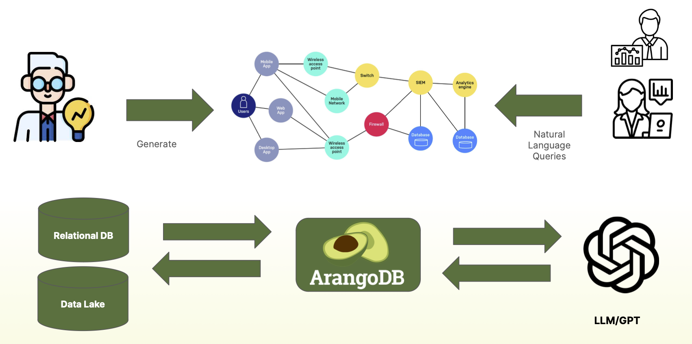

Large language models (LLMs) and knowledge graphs are two prominent and
contrasting concepts, each possessing unique characteristics and functionalities
that significantly impact the methods we employ to extract valuable insights from
constantly expanding and complex datasets.

LLMs, exemplified by OpenAI's ChatGPT, represent a class of powerful language
transformers. These models leverage advanced neural networks to exhibit a
remarkable proficiency in understanding, generating, and participating in
contextually-aware conversations.

On the other hand, knowledge graphs contain carefully structured data and are
designed to capture intricate relationships among discrete and seemingly
unrelated information. With knowledge graphs, you can explore contextual
insights and execute structured queries that reveal hidden connections within
complex datasets. 

ArangoDB's unique capabilities and flexible integration of knowledge graphs and
LLMs provide a powerful and efficient solution for anyone seeking to extract
valuable insights from diverse datasets.

## Knowledge Graphs

A knowledge graph can be thought of as a dynamic and interconnected network of
real-world entities and the intricate relationships that exist between them.

Key aspects of knowledge graphs:
- **Domain specific knowledge**: You can tailor knowledge graphs to specific
  domains and industries.
- **Structured information**: Makes it easy to query, analyze, and extract
  meaningful insights from your data.
- **Accessibility**: You can build a Semantic Web knowledge graph or using
  custom data.

LLMs can help distill knowledge graphs from natural language by performing
the following tasks:
- Entity discovery
- Relation extraction
- Coreference resolution
- End-to-end knowledge graph construction
- (Text) Embeddings

## ArangoDB and LangChain

[LangChain](https://www.langchain.com/) is a framework for developing applications
powered by language models.

LangChain enables applications that are:
- Data-aware (connect a language model to other sources of data)
- Agentic (allow a language model to interact with its environment)

The ArangoDB integration with LangChain provides you the ability to analyze
data seamlessly via natural language, eliminating the need for query language
design. By using LLM chat models such as OpenAI’s ChatGPT, you can "speak" to
your data instead of querying it.

### Get started with ArangoDB QA chain

The [ArangoDB QA chain notebook](https://langchain-langchain.vercel.app/docs/integrations/providers/arangodb/)
shows how to use LLMs to provide a natural language interface to an ArangoDB
instance.

Run the notebook directly in [Google Colab](https://colab.research.google.com/github/arangodb/interactive_tutorials/blob/master/notebooks/Langchain.ipynb).

See also other [machine learning interactive tutorials](https://github.com/arangodb/interactive_tutorials#machine-learning).