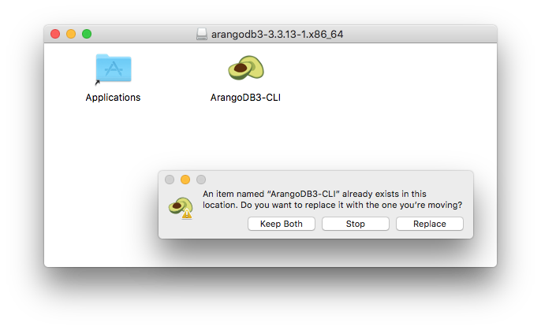

If you installed ArangoDB on macOS using a _DMG_ package for a single server
installation, follow the instructions below to upgrade the deployment.


It is highly recommended to take a backup of your data before upgrading ArangoDB
using [_arangodump_](../../../components/tools/arangodump/_index.md).


## Upgrading via Package

[Download](https://www.arangodb.com/download/) the latest
ArangoDB macOS package and install it as usual by mounting the `.dmg` file.
Drag and drop the `ArangoDB3-CLI` (Community Edition) or the `ArangoDB3e-CLI`
(Enterprise Edition) file onto the shown `Applications` folder.
You are asked if you want to replace the old file with the newer one.

 

Select `Replace` to install the new ArangoDB version.

## Upgrading more complex environments

The procedure described above is a first step to upgrade more complex
deployments such as
[Cluster](../../../deploy/cluster/_index.md)
and [Active Failover](../../../deploy/active-failover/_index.md).
