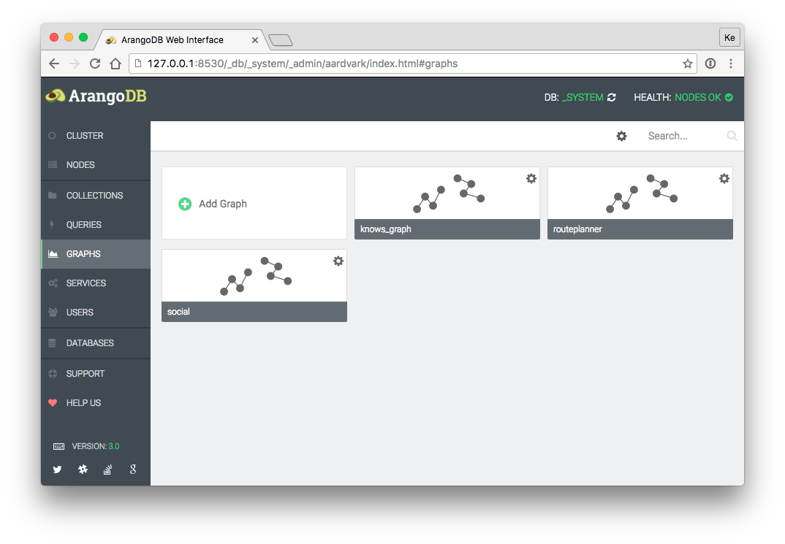
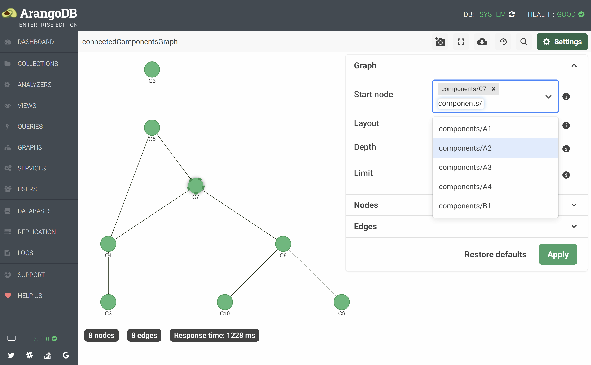

The **GRAPHS** section of the web interface lists the _named graphs_ stored in
ArangoDB (EnterpriseGraphs, SmartGraphs, SatelliteGraphs, General Graphs) and
lets you create new named graphs as well as view and edit the settings of
existing named graphs. It also provides a viewer facility for visualizing
subsets of a graph or an entire graph.

## Create a named graph

1. In the **GRAPHS** section, click the first card with the label **Add Graph**.
2. Select a tab depending on which type of named graph you want to create.
   The **SatelliteGraph**, **SmartGraph**, and **EnterpriseGraph** tabs are
   only available for cluster deployments using the Enterprise Edition.
   For non-cluster deployments and in the Community Edition, only the
   **Examples** and **GeneralGraph** tabs are available.
3. Fill in the fields of the dialog. Required fields have an asterisk (`*`)
   in their label. Hover over the gray circle with a white `i` in it next to
   a field to show the tooltip with an explanation.
4. Click the **Create** button to create the named graph.

For more information about the different types of named graphs and how to
create them, see [Graphs](../../graphs/_index.md).

## View and edit the settings of a named graph

1. In the **GRAPHS** section, click the _gear_ icon in the top right corner
   of a graph's card.
2. The setting dialog opens. You can only edit certain fields. Fields that 
   cannot be modified are grayed out.
3. Click the **Cancel** button or outside of the dialog to close it without
   saving any changes. Click **Save** to save changes.
   
## Delete a named graph

1. In the **GRAPHS** section, click the _gear_ icon in the top right corner
   of a graph's card.
2. Click the **Delete** button.
3. Optional: Tick the **also drop collections?** checkbox if you want to
   delete the vertex and edge collections of the graph as well and not the
   graph definition only. This deletes the collections with all the documents
   they contain and is irreversible!
4. Confirm the deletion by clicking the **Yes** button.

## Graph viewer

The graph viewer opens if you click a graph's card in the **GRAPHS** section.
It randomly selects a start node and displays its neighborhood. By default,
up to 250 nodes that are directly connected to the start node as well as
their direct neighbors are selected. You can select one or more start nodes
and change the depth and the limit in the settings panel. You can also load
the entire graph via the toolbar, but only use this with small graphs.

### Viewport

The main area of the graph viewer is used for displaying the graph. You can
interact with it in the followings ways:

- Left-click a node or edge to select it. The document ID and the names of the
  document's top-level attributes are displayed at the bottom of the viewport.
  Hover an attribute name to view the attribute value as a tooltip.
- Left-click and drag nodes if you want to re-arrange them.
- Left-click and drag to move the entire graph within the viewport.
- Right-click to access the [Context menus](#context-menus).
- Use the [Toolbar](#toolbar), for example, to access the graph viewer **Settings**
- See the number of the currently displayed nodes and edges, and how long it
  took to load the graph. This is displayed at the bottom of the viewport.

### Toolbar

The toolbar at the top shows you the name of the graph and offers the following
actions and a toggle for the settings panel:

- Take a screenshot (_camera_ icon)
- Enter fullscreen (_rectangle corners_ icon)
- Load full graph (_cloud download_ icon)
- Switch to the old graph viewer (_clock with an arrow_ icon)
- Search nodes (_magnifier_ icon)
- Settings (_gear_ icon)

### Settings

The settings panel is divided into three collapsible sections and lets you
configure what to show of the graph and how.

**General**

- **Start node**: One or more document IDs to start the traversal from for
  displaying (a subset of) the graph. If no start node is specified, the
  graph viewer picks a random node.
- **Layout**: The graph layout algorithm for finding a sensible arrangement and
  visualizing the graph in 2D.
  - **forceAtlas2**: Assigns positions to nodes based on the principles of
    physical simulation, using repulsive and attractive forces. Works best with
    medium-sized graphs.
  - **hierarchical**: Arranges the graph uniformly to display a hierarchical
    structure (for example, a tree) that avoids edge crossings and overlaps.
    Works best with small graphs.
- **Depth**: The traversal depth for displaying the Start node's neighborhood.
  The default depth is **2**.
- **Limit**: The maximum number of nodes to display, even if the maximum depth
  is not reached. The default is **250** nodes. Set it to **0** for no limit.

**Nodes**

- **Node label**: The document attribute to use for node labels.
  The default is `_key`.
- **Default node color**: The color for nodes if no color attribute is set or
  as a fallback if the document does not have this attribute.
- **Color nodes by collection**: Give nodes stored in the same collection the
  same, randomly chosen color. Disables the default node color and the node
  color attribute field.
- **Node color attribute**: A document attribute to use for assigning a
  node color. Nodes with the same attribute value get the same, randomly
  chosen color.
- **Show collection name**: Whether to include the document's collection name
  in the node label.
- **Size by connections**: Scale nodes based on the number of inbound and
  outbound edges. Disables the sizing attribute field.
- **Sizing attribute**: A document attribute to use for scaling nodes. Attribute values need to be numeric.

**Edges**

- **Edge label**: The document attribute to use for edge labels.
  The default is none.
- **Default edge color**: The color for edges if no color attribute is set or
  as a fallback if the document does not have this attribute.
- **Color edges by collection**: Give edges stored in the same collection the
  same, randomly chosen color. Disables the default edge color and the edge
  color attribute field.
- **Edge color attribute**: A document attribute to use for assigning an
  edge color. Edges with the same attribute value get the same, randomly
  chosen color.
- **Show collection name**: Whether to include the document's collection name
  in the edge label.
- **Show edge direction**: Whether to display arrow heads on edge ends to show
  which way edges are pointing.
- **Type**: The style for edge lines or arcs.
  Can be **solid**, **dashed**, or **dotted**.

**Actions**

- **Restore defaults**: Reset the settings.
- **Apply**: Traverse and layout the graph according to the settings.

### Context menus

You can click the right mouse button to access the context menus. You can take
different actions depending on where you click.

**Background**

If you right-click a blank area anywhere in the graph viewer, you get the
options to create a node or edge.

- **Add node to database**: Opens a dialog that lets you specify a document key,
  select a collection to store the node in, and to set any document attributes.
- **Add edge to database**: Enables the _Add edge mode_. Left-click a node and
  drag the edge to the end node. A dialog opens that lets you specify a
  document key, select a collection to store the edge in, and to set any
  document attributes.

**Node**

If you right-click a node, the connected edges are highlighted and you get the
followings options:

- **Delete Node**: Opens a confirmation dialog for removing the document from
  the collection it is stored in.
  You can optionally **Delete connected edges too**.
- **Edit Node**: Opens a dialog for editing the document attributes.
- **Expand Node**: Follow this node's inbound and outbound edges and display
  its direct neighbors in addition to the already shown graph.
- **Set as Start Node**: Change the start node to this node and render the
  graph according to the settings.
- **Pin Node**: Locks the position of the node.

**Edge**

If you right-click an edge, you get the following options:

- **Delete edge**: Opens a confirmation dialog for removing the document from
  the collection it is stored in.
- **Edit edge**: Opens a dialog for editing the document attributes.
