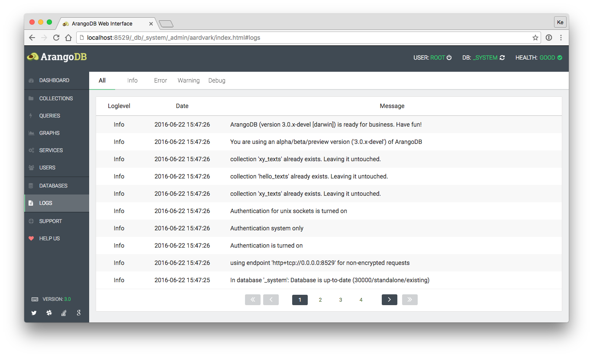

The logs section displays all available log entries. Log entries are filterable by
their log level types.

Functions:

 - Filter log entries by log level (all, info, error, warning, debug)

Information:

 - Loglevel
 - Date
 - Message
