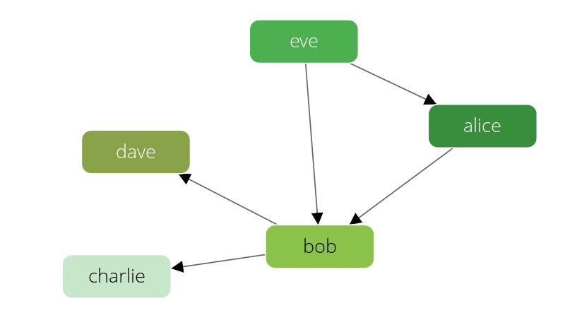
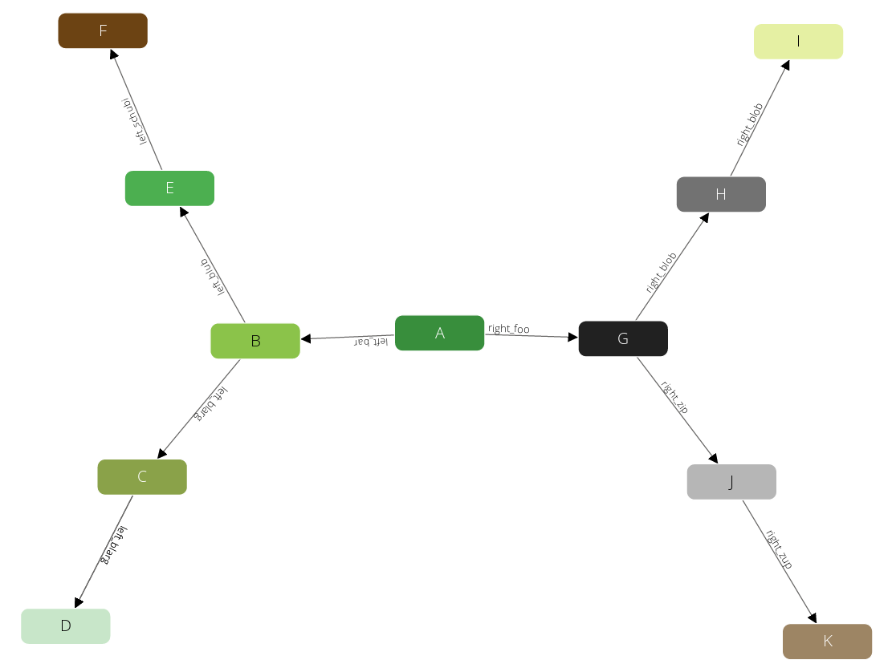
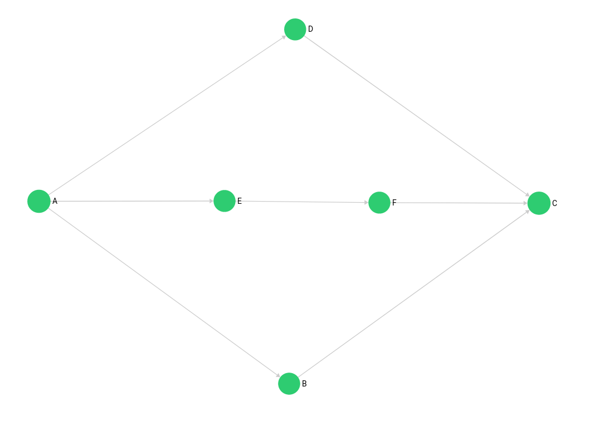
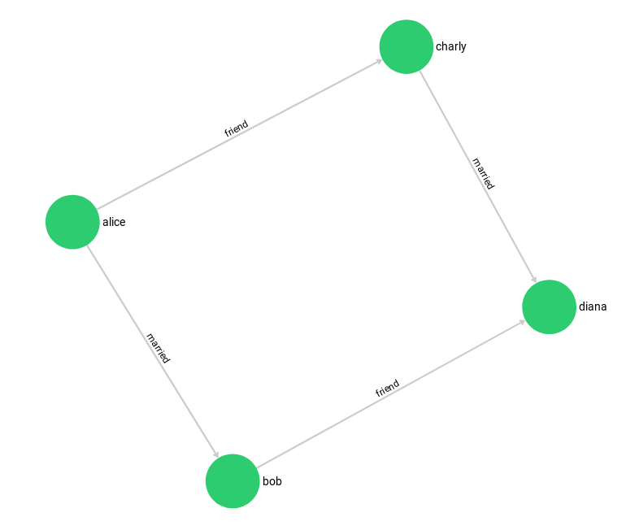
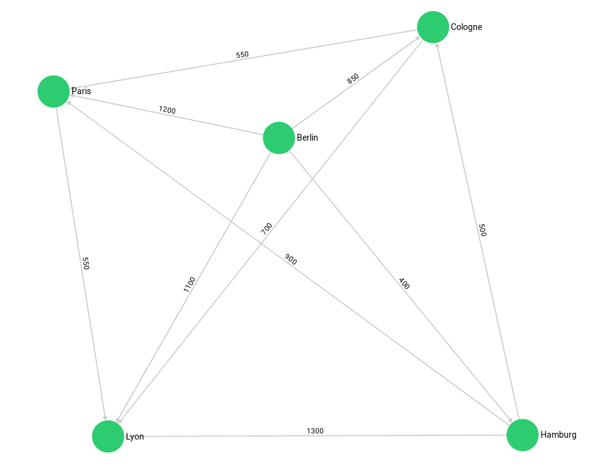
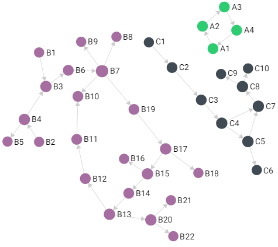

ArangoDB comes with a set of easy-to-understand graphs for demonstration
purposes.

- In the web interface, navigate to the **GRAPHS** section, click the
  **Add Graph** card, go to the **Examples** tab, and click the **Create** button of one of the listed graphs.

- In _arangosh_, run `require("@arangodb/graph-examples/example-graph").loadGraph("<name>");`
  with `<name>` substituted by the name of an example graph listed below.

You can visually explore the created graphs in the
[Graph viewer](../components/web-interface/graphs.md#graph-viewer)
of the web interface.

You can take a look at the script that creates the example graphs on
[GitHub](https://github.com/arangodb/arangodb/blob/devel/js/common/modules/%40arangodb/graph-examples/example-graph.js)
for reference about how to manage graphs programmatically.

## Knows Graph

The `knows` graph is a set of persons knowing each other:



The graph consists of a `persons` vertex collection connected via a `knows`
edge collection.
There are five persons, *Alice*, *Bob*, *Charlie*, *Dave*, and *Eve*.
They have the following directed relations:

- *Alice* knows *Bob*
- *Bob* knows *Charlie*
- *Bob* knows *Dave*
- *Eve* knows *Alice*
- *Eve* knows *Bob*

Example of how to create the graph, inspect its vertices and edges, and delete
it again:

```js
---
name: graph_create_knows_sample
description: ''
---
var examples = require("@arangodb/graph-examples/example-graph");
var g = examples.loadGraph("knows_graph");
db.persons.toArray()
db.knows.toArray();
examples.dropGraph("knows_graph");
```

**Note:** With the default traversal depth of 2 of the graph viewer, you may not
see all edges of this graph by default.

## Traversal Graph

The `traversalGraph` has been designed to demonstrate filters in traversals.
It has some labels to filter on it. The graph's vertices are in a collection
called `circles`, and it has an edge collection `edges` to connect them.



Circles have unique numeric labels. Edges have two boolean attributes
(`theFalse` always being `false`, `theTruth` always being `true`) and a label
sorting *B* - *D* to the left side, *G* - *K* to the right side.
Left and right side split into paths - at *B* and *G*, which are each direct
neighbors of the root-node *A*. Starting from *A*, the graph has a depth of 3 on
all its paths.

```js
---
name: graph_create_traversal_sample
description: ''
---
var examples = require("@arangodb/graph-examples/example-graph");
var g = examples.loadGraph("traversalGraph");
db.circles.toArray();
db.edges.toArray();
examples.dropGraph("traversalGraph");
```

**Note:** With the default traversal depth of 2 of the graph viewer, you may not
see all edges of this graph by default.

## k Shortest Paths Graph

The vertices in the `kShortestPathsGraph` graph are train stations of cities in
Europe and North America. The edges represent train connections between them,
with the travel time for both directions as edge weight.


See the [k Shortest Paths page](../aql/graph-queries/k-shortest-paths.md) for query examples.

```js
---
name: graph_create_kshortestpaths_sample
description: ''
---
var examples = require("@arangodb/graph-examples/example-graph");
var g = examples.loadGraph("kShortestPathsGraph");
db.places.toArray();
db.connections.toArray();
examples.dropGraph("kShortestPathsGraph");
```

## Mps Graph

The `mps_graph` has been created to demonstrate shortest path algorithms and
the abbreviation stands for **m**ultiple **p**ath **s**earch.

The example graph consists of vertices in the `mps_verts` collection and edges
in the `mps_edges` collection. It is a simple traversal graph with start node
*A* and end node *C*.



With the [Shortest Path](../aql/graph-queries/shortest-path.md) algorithm, you either
get the shortest path *A* - *B* - *C* or *A* - *D* - *C*. With the
[All Shortest Paths](../aql/graph-queries/all-shortest-paths.md) algorithm, both
shortest paths are returned.

Example of how to create the graph, inspect its vertices and edges, and delete
it again:

```js
---
name: graph_create_mps_sample
description: ''
---
var examples = require("@arangodb/graph-examples/example-graph");
var g = examples.loadGraph("mps_graph");
db.mps_verts.toArray();
db.mps_edges.toArray();
examples.dropGraph("mps_graph");
```

## World Graph

The `worldCountry` graph has as node structure as follows:

world → continent → country → capital


In some cases, edge directions aren't forward. Therefore, it may get displayed
disjunct in the graph viewer.

You can create the graph as a named graph using the name `worldCountry`, or as
an anonymous graph (vertex and edge collections only) using the name
`worldCountryUnManaged`.

```js
---
name: graph_create_world_sample
description: ''
---
var examples = require("@arangodb/graph-examples/example-graph");
var g = examples.loadGraph("worldCountry");
db.worldVertices.toArray();
db.worldEdges.toArray();
examples.dropGraph("worldCountry");
var g = examples.loadGraph("worldCountryUnManaged");
examples.dropGraph("worldCountryUnManaged");
```

## Social Graph

The `social` graph is a set of persons and their relations. The graph has
`female` and `male` persons as vertices in two vertex collections.
The edges are their connections and stored in the `relation` edge collection.



Example of how to create the graph, inspect its vertices and edges, and delete
it again:

```js
---
name: graph_create_social_sample
description: ''
---
var examples = require("@arangodb/graph-examples/example-graph");
var graph = examples.loadGraph("social");
db.female.toArray()
db.male.toArray()
db.relation.toArray()
examples.dropGraph("social");
```

## City Graph

The `routeplanner` graph is a set of european cities and their fictional
traveling distances as connections. The graph has the cities as vertices in
multiple vertex collections (`germanCity` and `frenchCity`). The edges are their
interconnections in several edge collections (`frenchHighway`, `germanHighway`,
`internationalHighway`).



Example of how to create the graph, inspect its edges and vertices, and delete
it again:

```js
---
name: graph_create_cities_sample
description: ''
---
var examples = require("@arangodb/graph-examples/example-graph");
var g = examples.loadGraph("routeplanner");
db.frenchCity.toArray();
db.germanCity.toArray();
db.germanHighway.toArray();
db.frenchHighway.toArray();
db.internationalHighway.toArray();
examples.dropGraph("routeplanner");
```

## Connected Components Graph

A small example graph comprised of `components` (vertices) and `connections`
(edges). Good for trying out Pregel algorithms such as Weakly Connected
Components (WCC).

Also see:
- [Distributed Iterative Graph Processing (Pregel)](../data-science/pregel/_index.md)
- [Pregel HTTP API](../develop/http-api/pregel.md)



```js
---
name: graph_create_connectedcomponentsgraph_sample
description: ''
---
var examples = require("@arangodb/graph-examples/example-graph");
var g = examples.loadGraph("connectedComponentsGraph");
db.components.toArray();
db.connections.toArray();
examples.dropGraph("connectedComponentsGraph");
```

## Higher volume graph examples

All of the above examples are rather small to make them easy to comprehend and
demonstrate how graphs work in ArangoDB. However, there are several, freely
available datasets on the web that are a lot bigger.

You can find a collection of datasets with import scripts on
[GitHub](https://github.com/arangodb/example-datasets).

Another huge graph is the [Pokec social network](https://snap.stanford.edu/data/soc-pokec.html)
from Slovakia.

## More examples

 - [AQL Example Queries on an Actors and Movies Database](../aql/examples-and-query-patterns/actors-and-movies-dataset-queries.md)
