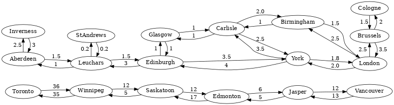

## General query idea

This type of query finds all paths between two given documents
(*startNode* and *endNode*) in your graph. The paths are restricted
by a minimum and maximum length that you specify.

Every such path is returned as a JSON object with two components:

- an array containing the `vertices` on the path
- an array containing the `edges` on the path

**Example**

Here is an example graph to explain how the k Paths algorithm works:



Each ellipse stands for a train station with the name of the city written inside
of it. They are the nodes of the graph. Arrows represent train connections
between cities and are the edges of the graph. The numbers near the arrows
describe how long it takes to get from one station to another. They are used
as edge weights.

Assume that you want to go from **Aberdeen** to **London** by train.

You have a couple of alternatives:

a) Straight way

   1. Aberdeen
   2. Leuchars
   3. Edinburgh
   4. York
   5. London

b) Detour at York

   1. Aberdeen
   2. Leuchars
   3. Edinburgh
   4. York
   5. **Carlisle**
   6. **Birmingham**
   7. London

c) Detour at Edinburgh

   1. Aberdeen
   2. Leuchars
   3. Edinburgh
   4. **Glasgow**
   5. **Carlisle**
   6. **Birmingham**
   7. London

d) Detour at Edinburgh to York

   1. Aberdeen
   2. Leuchars
   3. Edinburgh
   4. **Glasgow**
   5. **Carlisle**
   6. York
   7. London

Note that only paths that do not contain the same node twice are consider to
be valid. The following alternative would visit Aberdeen twice and is **not**
returned by the k Paths algorithm:

1. Aberdeen
2. **Inverness**
3. **Aberdeen**
4. Leuchars
5. Edinburgh
6. York
7. London

## Example Use Cases

The use-cases for k Paths are about the same as for unweighted k Shortest Paths.
The main difference is that k Shortest Paths enumerates all paths with
**increasing length**. It stops as soon as a given number of paths is reached.
k Paths enumerates all paths within a given **range of path lengths** instead,
and is thereby upper-bounded.

The k Paths traversal can be used as foundation for several other algorithms:

- **Transportation** of any kind (e.g. road traffic, network package routing)
- **Flow problems**: You need to transfer items from A to B, which alternatives
  do you have? What is their capacity?

## Syntax

The syntax for k Paths queries is similar to the one for
[K Shortest Path](k-shortest-paths.md) with the addition to define the
minimum and maximum length of the path.


It is highly recommended that you use a reasonable maximum path length or a
**LIMIT** statement, as k Paths is a potentially expensive operation. It can
return a large number of paths for large connected graphs.


### Working with named graphs

```aql
FOR path
  IN MIN..MAX OUTBOUND|INBOUND|ANY K_PATHS
  startNode TO endNode
  GRAPH graphName
  [OPTIONS options]
```

- `FOR`: Emits the variable **path** which contains one path as an object
  containing `vertices` (nodes) and `edges` of the path.
- `IN` `MIN..MAX`: The minimal and maximal depth for the traversal:
  - **min** (number, *optional*): Paths returned by this query
    have at least a length of this many edges.
    If not specified, it defaults to `1`. The minimal possible value is `0`.
  - **max** (number, *optional*): Paths returned by this query
    have at most a length of this many edges.
    If omitted, it defaults to the value of `min`. Thus, only the nodes and
    edges in the range of `min` are returned. You cannot specify `max` without `min`.
- `OUTBOUND|INBOUND|ANY`: Defines in which direction
  edges are followed (outgoing, incoming, or both).
- `K_PATHS`: The keyword to compute all paths with the specified lengths.
- **startNode** `TO` **endNode** (both string\|object): The two nodes
  between which the paths are computed. This can be specified in the form of
  a document identifier string or in the form of an object with the `_id`
  attribute. All other values lead to a warning and an empty result. This is
  also the case if one of the specified documents does not exist.
- `GRAPH` **graphName** (string): The name identifying the named graph.
  Its node and edge collections are looked up for the path search.
- `OPTIONS` **options** (object, *optional*):
  See the [path search options](#path-search-options).

### Working with collection sets

```aql
FOR path
  IN MIN..MAX OUTBOUND|INBOUND|ANY K_PATHS
  startNode TO endNode
  edgeCollection1, ..., edgeCollectionN
  [OPTIONS options]
```

Instead of `GRAPH graphName` you can specify a list of edge collections.
The involved node collections are determined by the edges of the given
edge collections.

### Path search options

You can optionally specify the following options to modify the execution of a
graph path search. If you specify unknown options, query warnings are raised.

#### `useCache`

<small>Introduced in: v3.12.2</small>

Whether to use the in-memory cache for edges. The default is `true`.

You can set this option to `false` to not make a large graph operation pollute
the edge cache.

### Traversing in mixed directions

For k paths with a list of edge collections you can optionally specify the
direction for some of the edge collections. Say for example you have three edge
collections *edges1*, *edges2* and *edges3*, where in *edges2* the direction
has no relevance, but in *edges1* and *edges3* the direction should be taken
into account. In this case you can use `OUTBOUND` as general search direction
and `ANY` specifically for *edges2* as follows:

```aql
FOR node IN OUTBOUND K_PATHS
  startNode TO endNode
  edges1, ANY edges2, edges3
```

All collections in the list that do not specify their own direction use the
direction defined after `IN` (here: `OUTBOUND`). This allows to use a different
direction for each collection in your path search.

### Graph path searches in a cluster

Due to the nature of graphs, edges may reference nodes from arbitrary
collections. Following the paths can thus involve documents from various
collections and it is not possible to predict which are visited in a
traversal. Which collections need to be loaded by the graph engine can only be
determined at run time.

Use the [`WITH` operation](../high-level-operations/with.md) to specify the
node collections you expect to be involved. This is required for traversals
using collection sets in cluster deployments. Declare the collection of the
start node as well if it's not declared already (like by a `FOR` loop).


From v3.12.6 onward, node collections are automatically deduced for graph
queries using collection sets / anonymous graphs if there is a named graph with
a matching edge collection in its edge definitions.

For example, suppose you have two node collections, `person` and `movie`, and
an `acts_in` edge collection that connects them. If you want to run a path search
query that starts (and ends) at a person that you specify with its document ID,
you need to declare both node collections at the beginning of the query:

```aql
WITH person, movie
FOR p IN 4 ANY K_PATHS "person/1544" TO "person/52560" acts_in
  LIMIT 2
  RETURN p.vertices[*].label
```

However, if there is a named graph that includes an edge definition for the
`acts_in` edge collection, with `person` as the _from_ collection and `movie`
as the _to_ collection, you can omit `WITH person, movie`. That is, if you
specify `acts_in` as an edge collection in an anonymous graph query, all
named graphs are checked for this edge collection, and if there is a matching
edge definition, its node collections are automatically added as data sources to
the query.

```aql
FOR p IN 4 ANY K_PATHS "person/1544" TO "person/52560" acts_in
  LIMIT 2
  RETURN p.vertices[*].label

// Chris Rock --> Dogma <-- Ben Affleck --> Surviving Christmas <-- Jennifer Morrison
// Chris Rock --> The Longest Yard <-- Rob Schneider --> Big Stan <-- Jennifer Morrison
```

You can still declare collections manually, in which case they are added as
data sources in addition to automatically deduced collections.


## Examples

You can load the `kShortestPathsGraph` example graph to get a named graph that
reflects some possible train connections in Europe and North America.


```js
---
name: GRAPHKP_01_create_graph
description: ''
---
~addIgnoreCollection("places");
~addIgnoreCollection("connections");
var examples = require("@arangodb/graph-examples/example-graph");
var graph = examples.loadGraph("kShortestPathsGraph");
db.places.toArray();
db.connections.toArray();
```

Suppose you want to query all routes from **Aberdeen** to **London**.

```aql
---
name: GRAPHKP_01_Aberdeen_to_London
description: ''
dataset: kShortestPathsGraph
---
FOR p IN 1..10 OUTBOUND K_PATHS 'places/Aberdeen' TO 'places/London'
GRAPH 'kShortestPathsGraph'
    RETURN { places: p.vertices[*].label, travelTimes: p.edges[*].travelTime }
```

If you ask for routes that don't exist, you get an empty result
(from **Aberdeen** to **Toronto**):

```aql
---
name: GRAPHKP_02_Aberdeen_to_Toronto
description: ''
dataset: kShortestPathsGraph
---
FOR p IN 1..10 OUTBOUND K_PATHS 'places/Aberdeen' TO 'places/Toronto'
GRAPH 'kShortestPathsGraph'
    RETURN { places: p.vertices[*].label, travelTimes: p.edges[*].travelTime }
```

And finally clean up by removing the named graph:

```js
---
name: GRAPHKP_99_drop_graph
description: ''
---
var examples = require("@arangodb/graph-examples/example-graph");
examples.dropGraph("kShortestPathsGraph");
~removeIgnoreCollection("places");
~removeIgnoreCollection("connections");
```
