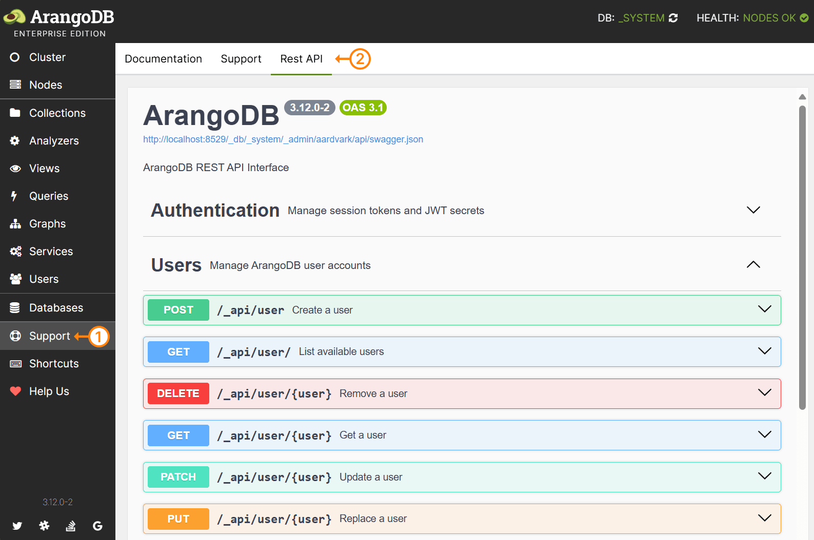

ArangoDB servers expose an application programming interface (API) for managing
the database system. It is based on the HTTP protocol that powers the
world wide web. All interactions with a server are ultimately carried out via
this HTTP API.

You can use the API by sending HTTP requests to the server directly, but the
more common way of communicating with the server is via a database
[driver](../../../../ecosystem/drivers/_index.md).
A driver abstracts the complexity of the API away by providing a simple
interface for your programming language or environment and handling things like
authentication, connection pooling, asynchronous requests, and multi-part replies
in the background. You can also use ArangoDB's [web interface](../../components/web-interface/_index.md),
the [arangosh](../../components/tools/arangodb-shell/_index.md) shell, or other tools.

The API documentation is relevant for you in the following cases:

- You want to build or extend a driver.
- You want to utilize a feature that isn't exposed by your driver or tool.
- You need to send many requests and avoid any overhead that a driver or tool might add.
- You operate a server instance and need to perform administrative actions via the API.
- You are interested in how the low-level communication works.

## REST-inspired API

The API is inspired by the design principles of [REST](https://en.wikipedia.org/wiki/Representational_state_transfer)
(Representational State Transfer) and follows many of its conventions, but it
does not implement all of them. It is best described as a resource-oriented
HTTP API rather than a strictly RESTful one.

The following REST characteristics apply:

- **Resources are identified by URIs**: A resource can be a database record, a
  server log, or any other data entity or object, and you address it by a URI
  such as `/_api/document/{collection}/{key}`.
- **Operations are expressed with standard HTTP methods**: Mainly `GET` for
  reading, `POST` for creating, `PATCH` for updating, `PUT` for replacing,
  `DELETE` for removing, and `HEAD` for reading metadata only.
- **Resources are transferred as representations**: Documents and other
  resources are exchanged as JSON (or VelocyPack), independent of how the server
  stores them internally.
- **Standard HTTP status codes indicate the outcome**: For example, `200` and
  `201` on success, `404` for a missing resource, and `409` for a conflict.

The following REST constraints are not met:

- **No hypermedia (HATEOAS)**: Responses do not link to related resources or to
  the operations available next, so you cannot discover the API by following
  links. You need this documentation or the OpenAPI specification to know which
  endpoints exist and how to call them.
- **Not every endpoint is resource-oriented**: Many endpoints are remote
  procedure calls rather than operations on a resource, such as
  `POST /_api/cursor` for running an AQL query, `POST /_api/transaction/begin`
  for starting a Stream Transaction, and most of the `/_admin/*` endpoints.
- **Not every interaction is stateless**: Most requests are self-contained, but
  [cursors](queries/aql-queries.md) and
  [Stream Transactions](transactions/stream-transactions.md) keep state on the
  server that follow-up requests refer to by identifier, like
  `POST /_api/cursor/{cursor-id}` and `/_api/transaction/{transaction-id}`.
- **Responses are not cacheable**: The server marks every response as
  non-cacheable with `Cache-Control: no-cache, no-store, must-revalidate`,
  `Pragma: no-cache`, and `Expires: 0`, so HTTP caching plays no role.

### URL components

A request URL can look like this:

`http://localhost:8529/_db/DATABASE/_api/document/COLLECTION/KEY?returnOld=true&keepNull=false`

- `http://localhost:8529` is the **origin**:
  - `http` is the **scheme**, which is `https` if you use TLS encryption
  - `localhost` is the **host**, which can be an IP address or a domain name
    including subdomains
  - `8529` is the **port**
- `/_db/DATABASE/_api/document/COLLECTION/KEY?returnOld=true&keepNull=false`
  is the **request target**:
  - `/_db/DATABASE/_api/document/COLLECTION/KEY` is the **path**, made up of the
    segments `_db`, `DATABASE`, `_api`, and so on
  - `returnOld=true&keepNull=false` is the **query string**, a series of
    key/value pairs separated by ampersands (`returnOld` is set to `true`
    and so on)

Browsers and programming languages often expose these parts under slightly
different names that include the delimiters, like `protocol` for `http:`,
`pathname` for the path, and `search` for `?returnOld=true&keepNull=false`.

### How to read endpoint descriptions

The HTTP API documentation mainly describes the available **endpoints**, like
for updating a document, creating a graph, enabling the maintenance mode, and so
on. Each endpoint description starts with the HTTP method and the URL structure:

{{< endpoint "PATCH" "http://<EXTERNAL_ENDPOINT>:8529/_db/{database}/_api/document/{collection}/{key}" >}}

When endpoints are referenced in the documentation, they are often abbreviated
as follows:\
`PATCH /_api/document/{collection}/{key}`

- The `PATCH` method is generally for updating, `PUT` for replacing, `POST` for
  creating (or triggering an action), `DELETE` for removing, `GET` for reading,
  `HEAD` for reading metadata only. There are exceptions where endpoints don't
  strictly adhere to this.

- `http://<EXTERNAL_ENDPOINT>:8529` is the origin that you need to adjust
  according to your server configuration and depending on whether you access the
  server locally or via a network.

- `/_api/document/…` is the path of ArangoDB's HTTP API for handling documents.
  It can be preceded by `/_db/:database`, with `:database` replaced by a
  database name, to select another database than the default `_system` database.

- `:collection` and `:key` (and `:database`) are placeholders called
  **Path Parameters** that you have to replace with a collection name and
  document key (and database name) in this case. They are always required.

  The convention with the leading colon is recognized by tools that let you send
  HTTP requests using a visual interface. They show a form for the parameters.
  A path segment wrapped in `{` and `}` has the same meaning in the
  documentation, but is typically not recognized by these tools.

- The pathname can be followed by a question mark and the so-called
  **Query Parameters**, which is a series of key/value pairs separated by
  ampersands to set options, like
  `/_api/document/COLLECTION/KEY?returnOld=true&keepNull=false`.
  If a query parameter is required, it is labelled as such. Otherwise it is
  optional.

- Some endpoints allow you to specify **HTTP headers** in the request
  (not in the URL), like `If-Match: "REVISION"`.

- A **Request Body** is the payload you may need to send, typically JSON data.
  This is often a JSON object with multiple attributes. Required attributes are
  labelled as such.

- **Responses** are the possible HTTP responses in reply to your request in
  terms of the HTTP status code (e.g. `202`) and typically a JSON payload with a
  result or error information. This is often a JSON object with multiple
  attributes. Attributes that are conditionally included in the server response
  are labelled as optional. Otherwise they are always present.

On the wire, a simplified HTTP request can look like this:

```
PATCH /_api/document/coll1/docA?returnOld=true HTTP/1.1
Host: localhost:8529
Authorization: Basic cm9vdDo=
If-Match: "_hV2oH9y---"
Content-Type: application/json; charset=utf-8
Content-Length: 20

{"attr":"new value"}
```

And a simplified HTTP response can look like this:

```
HTTP/1.1 202 Accepted
Etag: "_hV2r5XW---"
Location: /_db/_system/_api/document/coll1/docA
Server: ArangoDB
Connection: Keep-Alive
Content-Type: application/json; charset=utf-8
Content-Length: 160

{"_id":"coll1/docA","_key":"docA","_rev":"_hV2r5XW---","_oldRev":"_hV2oH9y---","old":{"_key":"docA","_id":"coll1/docA","_rev":"_hV2oH9y---","attr":"value"}}
```

## Swagger specification

ArangoDB's HTTP API is documented using the industry-standard
**OpenAPI Specification**, more specifically [OpenAPI version 3.1](https://swagger.io/specification/).
You can explore the API with the interactive **Swagger UI** using the
[ArangoDB web interface](../../components/web-interface/_index.md).

1. Click **Support** in the main navigation of the web interface.
2. Click the **Rest API** tab.
3. Click a section and endpoint to view the description and parameters.


