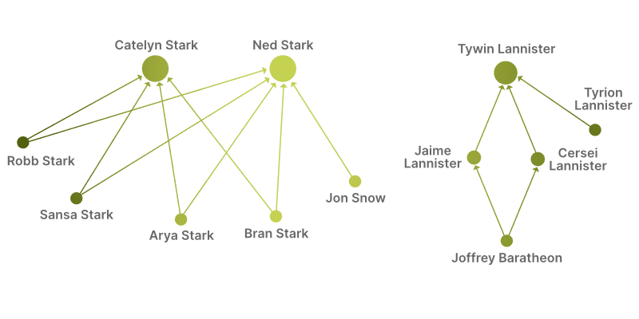

Relations such as between parents and children can be modeled as graph.
In ArangoDB, two documents (a parent and a child character document) can be
linked by an edge document. Edge documents are stored in edge collections and
have two additional attributes: `_from` and `_to`. They reference any two
documents by their document IDs (`_id`).

## ChildOf relations

Our characters have the following relations between parents and children
(first names only for a better overview):

```
    Robb -> Ned
   Sansa -> Ned
    Arya -> Ned
    Bran -> Ned
     Jon -> Ned
    Robb -> Catelyn
   Sansa -> Catelyn
    Arya -> Catelyn
    Bran -> Catelyn
   Jaime -> Tywin
  Cersei -> Tywin
  Tyrion -> Tywin
 Joffrey -> Jaime
 Joffrey -> Cersei
```

Visualized as a graph:



## Creating the edges

To create the required edge documents to store these relations in the database,
you can run a query that combines joining and filtering to match up the right
character documents, then use their `_id` attribute to insert an edge into an
edge collection called `ChildOf`.

1. Click **Collections** in the main navigation.
2. Click the **Add collection** button.
3. Enter `ChildOf` as the **Name**.
4. Change the collection type to **Edge**.

Then run the following query:

```aql
LET relations = [
  { "parent": "ned", "child": "robb" },
  { "parent": "ned", "child": "sansa" },
  { "parent": "ned", "child": "arya" },
  { "parent": "ned", "child": "bran" },
  { "parent": "catelyn", "child": "robb" },
  { "parent": "catelyn", "child": "sansa" },
  { "parent": "catelyn", "child": "arya" },
  { "parent": "catelyn", "child": "bran" },
  { "parent": "ned", "child": "jon" },
  { "parent": "tywin", "child": "jaime" },
  { "parent": "tywin", "child": "cersei" },
  { "parent": "tywin", "child": "tyrion" },
  { "parent": "cersei", "child": "joffrey" },
  { "parent": "jaime", "child": "joffrey" }
]

FOR rel in relations
  INSERT {
    _from: CONCAT("Characters/", rel.child),
    _to: CONCAT("Characters/", rel.parent)
  } INTO ChildOf
  RETURN NEW
```

Breakdown of the query:

- Assign the relations in form of an array of objects with a `parent` and
  a `child` attribute each, both with the document key of the character.
- For each element in this array, assign a relation to a variable `rel` and
  execute the subsequent instructions.
  - Insert a new edge document into the ChildOf collection, with the edge going
    from `child` to `parent`. The `_from` and `_to` edge attributes require
    document IDs like `collection/key`. Therefore, the document keys derived
    from the character names are prefixed with `Characters/` to obtain the IDs.
    No other attributes are set for the edge in this example.
  - Return the new edge document (optional)

## Traverse to the parents

Now that edges link character documents (nodes), it is a graph you can
query to find out who the parents are of another character – or in
graph terms, you want to start at a node and follow the edges to other
nodes in an [AQL graph traversal](../../aql/graph-queries/traversals.md):

```aql
// Declare collection of start node (cluster only)
WITH Characters

FOR v IN 1..1 OUTBOUND "Characters/bran" ChildOf
  RETURN v.name
```

This `FOR` loop doesn't iterate over a collection or an array, it walks the
graph and iterates over the connected nodes it finds, with the node
document assigned to a variable (here: `v`). It can also emit the edges it
walked as well as the full path from start to end to
[another two variables](../../aql/graph-queries/traversals.md#syntax).

In above query, the traversal is restricted to a minimum and maximum traversal
depth of 1 (how many steps to take from the start node), and to only follow
edges in `OUTBOUND` direction. Our edges point from child to parent, and the
parent is one step away from the child, thus it gives you the parents of the
child you start at. `"Characters/bran"` is that start node.

To determine the ID of e.g. the Joffrey Baratheon document, you may iterate over
the collection of characters, filter by the name or other criteria, and return
the `_id` attribute:

```aql
FOR c IN Characters
  FILTER c.surname == "Baratheon" AND c.age != null
  RETURN c._id
```

```json
[ "Characters/joffrey" ]
```

You may also combine this query with the traversal directly, to easily change
the start node by adjusting the filter condition(s):

```aql
FOR c IN Characters
  FILTER c.surname == "Baratheon" AND c.age != null
  FOR v IN 1..1 OUTBOUND c ChildOf
    RETURN v.name
```

The start node is followed by `ChildOf`, which is our edge collection. The
example query returns only the name of each parent to keep the result short:

```json
[
  "Jaime",
  "Cersei"
]
```

For Robb, Sansa, Arya, and Bran as the starting point, the result is Catelyn and
Ned, and for Jon Snow it is only Ned.

Be mindful of the `FILTER` criteria. If more than one character fulfills the
conditions, there will be multiple traversals. And with the query as it is,
all of the parent names would be combined into a single list:

```aql
FOR c IN Characters
  FILTER c.surname == "Lannister"
  FOR v IN 1..1 OUTBOUND c ChildOf
    RETURN v.name
```

```json
[
  "Tywin",
  "Tywin",
  "Tywin"
]
```

You can achieve a more useful output by returning the result of each traversal
as a separate list and set the minimum traversal depth to `0` to include the
start node. This lets you see the child's name as the first element of each
array, followed by the parent name(s) if this information is available.

```aql
FOR c IN Characters
  FILTER c.surname == "Lannister"
  RETURN (FOR v IN 0..1 OUTBOUND c ChildOf
    RETURN v.name)
```

```json
[
  [
    "Jaime",
    "Tywin"
  ],
  [
    "Cersei",
    "Tywin"
  ],
  [
    "Tyrion",
    "Tywin"
  ],
  [
    "Tywin"
  ]
]
```

## Traverse to the children

You can also walk from a parent in reverse edge direction (`INBOUND` that is)
to the children:

```aql
FOR c IN Characters
  FILTER c.name == "Ned"
  FOR v IN 1..1 INBOUND c ChildOf
    RETURN v.name
```

```json
[
  "Robb",
  "Sansa",
  "Jon",
  "Arya",
  "Bran"
]
```

## Traverse to the grandchildren

For the Lannister family, there are relations that span from parent to
grandchild. Change the traversal depth to return grandchildren,
which means to go exactly two steps:

```aql
FOR c IN Characters
  FILTER c.name == "Tywin"
  FOR v IN 2..2 INBOUND c ChildOf
    RETURN v.name
```

```json
[
  "Joffrey",
  "Joffrey"
]
```

It might be a bit unexpected, that Joffrey is returned twice. However, if you
look at the graph visualization, you can see that multiple paths lead from
Joffrey (bottom right) to Tywin:


```
Tywin <- Jaime  <- Joffrey
Tywin <- Cersei <- Joffrey
```

As a quick fix, change the last line of the query to `RETURN DISTINCT v.name`
to return each value only once. However, there are
[traversal options](../../aql/graph-queries/traversals.md#syntax) including one to
suppress duplicate nodes early on for the entire traversal (which requires
breadth-first search):

```aql
FOR c IN Characters
  FILTER c.name == "Tywin"
  FOR v IN 2..2 INBOUND c ChildOf OPTIONS { uniqueVertices: "global", order: "bfs" }
    RETURN v.name
```

```json
[
  "Joffrey"
]
```

## Traverse with variable depth

To return the parents and grandparents of Joffrey, you can walk edges in
`OUTBOUND` direction and adjust the traversal depth to go at least 1 step,
and 2 at most:

```aql
FOR c IN Characters
  FILTER c.name == "Joffrey"
  FOR v IN 1..2 OUTBOUND c ChildOf
    RETURN DISTINCT v.name
```

```json
[
  "Cersei",
  "Tywin",
  "Jaime"
]
```

With deeper family trees, it would only be a matter of changing the depth
values to query for great-grandchildren and similar relations.
