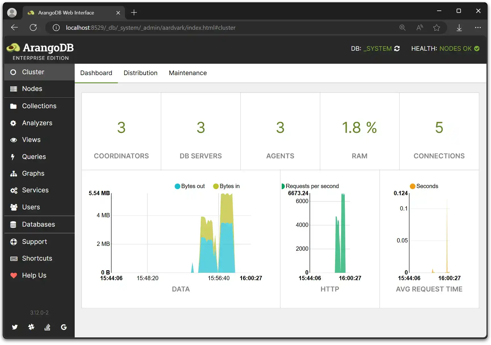

The web interface differs for cluster deployments and single-server instances.
Instead of a single [Dashboard](dashboard.md), there
is a **Cluster** and a **Nodes** section.

Furthermore, the **Replication** and **Logs** section are not available.
You can access the logs of individual Coordinators and DB-Servers via the
**Nodes** section.

## Cluster

The **Cluster** section displays statistics about the general cluster performance.

Statistics:

- Available and missing Coordinators
- Available and missing DB-Servers
- Memory usage (percent)
- Current connections
- Data (bytes)
- HTTP (bytes)
- Average request time (seconds)

Distribution:

- Number of databases and collections
- Number of shards, leader shards, follower shards etc.
- Shard distribution
- [Shard rebalancing](#shard-rebalancing)

Maintenance:

- Toggle the cluster supervision maintenance mode

### Shard rebalancing

Over time, imbalances in the data distribution and shard leaders and followers
can occur in clusters. You can manually trigger a rebalancing operation to
achieve a more even distribution.

A new DB-Server does not have any shards. With the rebalance functionality, the
cluster starts to rebalance shards including empty DB-Servers. You can specify
the maximum number of shards that can be moved in each operation by using the
[`--cluster.max-number-of-move-shards` startup option](../arangodb-server/options.md#--clustermax-number-of-move-shards)
of _arangod_.

You can set the following options:
- **Move Leaders**
- **Move Followers**
- **Include System Collections**

When you click the **Rebalance** button, the number of scheduled move shards
operations is shown, or it is displayed that no move operations have been
scheduled if they are not necessary.

## Nodes

The **Nodes** section provides an overview over the cluster nodes and a way to
access information about the individual Coordinators and DB-Servers.

### Overview

The **Overview** tab shows available and missing Coordinators and DB-Servers.

Functions:

- Coordinator Dashboard: Click a Coordinator to open a statistics dashboard.

Information (Coordinator / DB-Servers):

- Name
- Endpoint
- Last Heartbeat
- Status
- Health

### Shards

The **Shards** tab displays all available sharded collections, their leaders
and followers.

To move a shard leader or follower to a different DB-Server, click one of the
**Leader** or **Followers** entries to open a move shard dialog.

The leadership of a shard can be transferred to all available DB-Servers except
the current leading DB-Server.

You can move a follower to a different DB-Server if it is available and neither
the leading DB-Server or the following DB-Server itself.
