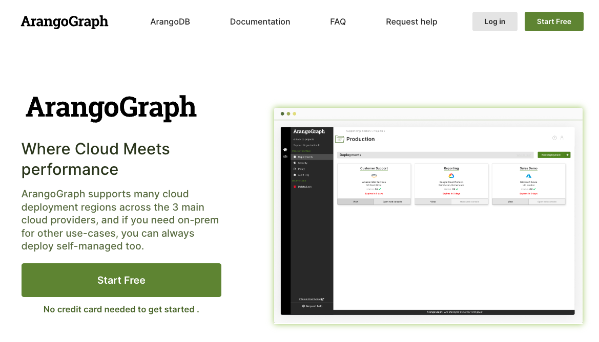
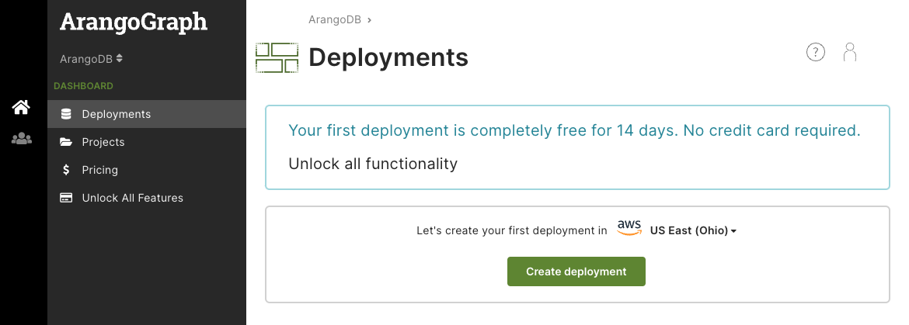
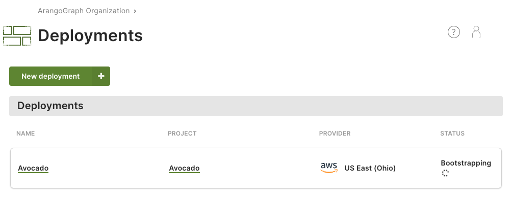
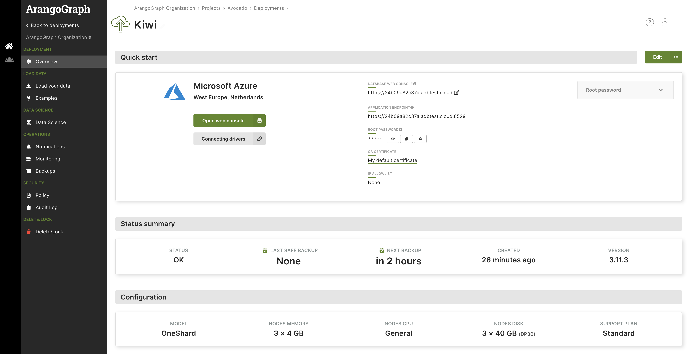
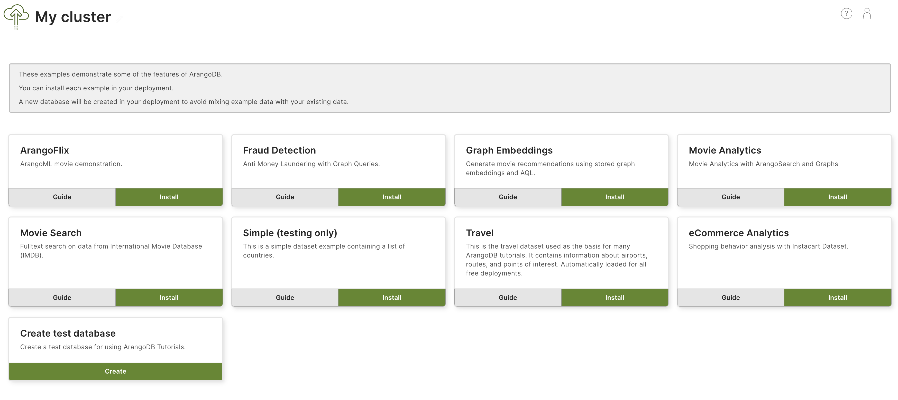

For general information about the Arango Managed Platform (AMP), see
[dashboard.arangodb.cloud](https://dashboard.arangodb.cloud/home?utm_source=docs&utm_medium=cluster_pages&utm_campaign=docs_traffic).

For guides and reference documentation, see the
[Arango Managed Platform (AMP) documentation](../../../amp/_index.md).

## Prerequisites

Please have following information at hand for registration:

- An **email address**, required for email verification.

If you use a public email service provider (e.g. Hotmail), make sure to have
the following information at hand as well:

- A **mobile phone number**, required for SMS verification


One mobile phone number is associated with one account and cannot be
used for multiple accounts.


## How to Create a New Account

1. Go to [dashboard.arangodb.cloud](https://dashboard.arangodb.cloud/home?utm_source=docs&utm_medium=cluster_pages&utm_campaign=docs_traffic).
2. Click the __Start Free__ button or click the __Sign Up__ link in the top
   right corner.

   

3. Review the terms & conditions and privacy policy and click __I accept__.
4. Select the type of sign up you would like to use (GitHub, Google, or
   email address).
   - For GitHub, Google, and Microsoft please follow the on-screen instructions.
   - For the email address option, type your desired email address in the
     email field and type a strong password in the password field.

   

   Click the __Sign up__ button. You will receive a verification email. In that
   mail, click the __Verify my email address__ link or button.
   It opens a page in the Arango Managed Platform (AMP) that says __Welcome back!__
5. Click the __Log in__ button to continue and login.
6. If you signed up with an email address of a public email service provider (e.g. Hotmail),
   a form appears asking for your mobile phone number. Enter the country code
   and the number of the mobile phone you want to use for this account.
   For company email addresses, this step is skipped.
7. If you had to enter your phone number in the previous step, a verification
   code is sent via SMS to the mobile number you entered. Enter the
   verification code.
8. Fill out a form with your first and last name, and company
   name, and then press the __Save__ button.
9. An organization with a default project is now prepared for you.
   Once that is completed, you are redirected to the
   [ArangoGraph dashboard](https://dashboard.arangodb.cloud/home?utm_source=docs&utm_medium=cluster_pages&utm_campaign=docs_traffic).

## Get a Deployment up and Running

1. The first card in the AMP Dashboard has a dropdown menu to select a cloud
   provider and region. Pick one and click __Create deployment__. You can also select
   your intended use-case.

   

   You can also [create a deployment](../../../amp/deployments/_index.md#how-to-create-a-new-deployment)
   manually, if you want fine-grained configuration options.
2. The new deployment is displayed in the list of deployments for the 
   respective project (here: _Avocado_).

   

   It takes a couple of minutes before the deployment can be used. The status
   is changed from __Bootstrapping__ to __OK__ eventually and you also
   receive an email when it is ready.

   

3. Click the name of the deployment (or the __Open deployment details__ link in
   the email) to view the deployment details.

   

4. Click the __Open database UI__ button to open the ArangoDB web interface.

5. You can install example datasets and follow the accompanying guides to get
   started with ArangoDB and its query language. In the AMP dashboard, click
   the __Examples__ tab of the deployment. Click __Install__ for one of the
   examples to let AMP create a separate database and import the dataset.
   Click __Guide__ for instructions on how to access and run queries against
   this data.

   

   

## General Hierarchy

The Arango Managed Platform (AMP) supports multi-tenant setups via organizations.
You can create your own organization(s) and invite collaborators or join
existing ones via invites. Your organization contains projects.
Your projects hold your deployments.

- [**Organizations**](../../../amp/organizations/_index.md)
  represent (commercial) entities such as companies.
  You can be part of multiple organizations with a single user account.
  - [**Projects**](../../../amp/projects.md)
    represent organizational units such as teams or applications.
    - [**Deployments**](../../../amp/deployments/_index.md)
      are the actual instances of ArangoDB clusters.

When you sign up for AMP, an organization and a default project are
automatically created for you. What is still missing is a deployment.

## Take the Tour

In the top right corner you find the __User toolbar__. Click the icon with the
question mark to bring up the help menu and choose __Start tour__. This guided
tour walks you through the creation of a deployment and shows you how to load
example datasets and manage projects and deployments.

Alternatively, follow the steps of the linked guides:
- [Create a new project](../../../amp/projects.md#how-to-create-a-new-project) (optional)
- [Create a new deployment](../../../amp/deployments/_index.md#how-to-create-a-new-deployment)
- [Install a new certificate](../../../amp/security-and-access-control/x-509-certificates.md) (optional)
- [Access your deployment](../../../amp/deployments/_index.md#how-to-access-your-deployment)
- [Delete your deployment](../../../amp/deployments/_index.md#how-to-delete-a-deployment)

## Free-to-Try vs. Paid

The Arango Managed Platform (AMP) comes with a free-to-try tier that lets you test
the Arango cloud for free for 14 days. It includes one project and one small
deployment of 4GB, local backups, and one notebook for learning and data science.
After the trial period, your deployment is automatically deleted.

You can unlock all features in AMP at any time by adding 
your billing details and at least one payment method. See:
- [AMP Packages](../../../amp/organizations/_index.md#amp-packages)
- [How to add billing details to organizations](../../../amp/organizations/billing.md#how-to-add-billing-details)
- [How to add a payment method to an organization](../../../amp/organizations/billing.md#how-to-add-a-payment-method)

## Managed Cloud Service vs. On-premises Comparison: Key Differences

The Arango Managed Platform (AMP) aims to make all features of ArangoDB
available to you, but there are a few key differences:

- Encryption (both at rest & network traffic) is always on and cannot be
  disabled for security reasons.
- Foxx services are not allowed to call out to the internet by default for
  security reasons, but can be enabled on request.
  Incoming calls to Foxx services are fully supported.

For more information, see the [comparison between on-premises editions and the managed cloud service](https://www.arangodb.com/subscriptions/).
