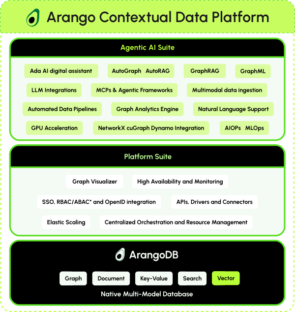

The Arango Contextual Data Platform brings everything Arango offers together
in a single solution that you can deploy and self-manage on-premises or in the
cloud, or use as a managed service - [Arango Managed Platform (AMP)](../amp/_index.md).

The Arango Contextual Data Platform is a layered architecture that combines
powerful components into a unified solution. It builds on the Arango Data Platform,
combining the [Platform Suite](../platform-suite/_index.md) with the
[Agentic AI Suite](../agentic-ai-suite/_index.md). The ArangoDB multi-model
database system is the foundation for it all.

The Data Platform is a [**Kubernetes-native**](kubernetes.md) technical infrastructure that
acts as the umbrella for hosting the entire Arango offering of products.
Built from the ground up for cloud-native orchestration, the platform leverages
the power of Kubernetes to make it easy to deploy, scale, and operate the core
ArangoDB database system along with additional services and AI solutions for
GraphRAG, graph machine learning, data explorations, and more. You can
run it on-premises or in the cloud yourself on top of Kubernetes to access all
of the platform features with enterprise-grade automation and reliability.

What you get on top of the Arango Data Platform with the Agentic AI Suite:

- [GraphRAG](../agentic-ai-suite/graphrag/_index.md): Generate knowledge graphs from documents and enable
   conversational querying of your data.
- [GraphML](../agentic-ai-suite/graphml/_index.md): Apply machine learning algorithms that leverage graph
  structure for better predictions.
- [AQLizer](../agentic-ai-suite/aqlizer.md): Generate AQL queries from natural language.
- [Jupyter notebooks](../agentic-ai-suite/notebook-servers.md): Run Jupyter Notebooks to build and
  experiment with graph-powered data, AI, and machine learning workflows directly connected
  to ArangoDB databases. 
- Public and private LLM support: Use public LLMs such as OpenAI
  or private LLMs with [Triton Inference Server](../agentic-ai-suite/reference/triton-inference-server.md).
- [MLflow integration](../agentic-ai-suite/reference/mlflow.md): Use the popular MLflow as a model registry
  for private LLMs or to run machine learning experiments as part of the Arango Data Platform.
