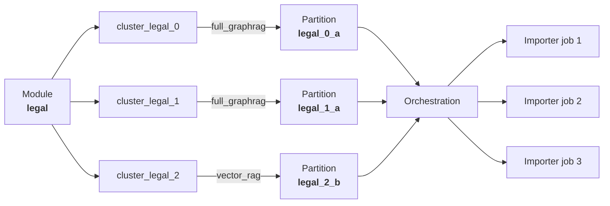

The Importer is the worker of the [AutoGraph service](../_index.md). This page
describes what it writes, how AutoGraph drives it, the cases in which you
configure or call it yourself, and its HTTP API.

## What the Importer builds

The Importer turns documents into a **knowledge graph** stored in
your ArangoDB database. It chunks text, calls configured chat and embedding
models, extracts entities and communities (in full GraphRAG mode), writes the
graph data, and creates vector indexes where embeddings exist.

The resulting knowledge graph is the data layer your applications query with
[AutoRAG](../../autorag/_index.md) or with AQL directly.

In [AutoGraph Studio](../../_index.md), the Importer is the worker of the
[AutoGraph service](../_index.md): the orchestration installs Importer
replicas, submits one import job per partition, monitors them, and tears them
down again. You configure the Importer, but you do not normally call it.

## How AutoGraph runs the Importer

When you need to process large or heterogeneous document collections,
[AutoGraph](../_index.md) manages the Importer for you. AutoGraph
automatically discovers knowledge domains in your data, assigns the optimal
RAG strategy (`full_graphrag` or `vector_rag`) per domain, and spawns
Importer workers to build partitioned knowledge graphs.

In this mode, you **do not call the Importer directly**. AutoGraph handles
replica creation, job submission, `partition_id` and `rag_mode` assignment,
status polling, and teardown.

### Three-layer architecture

AutoGraph organizes data across three layers. Each layer has a clear owner
and purpose:

| Layer | Built by | Named Graph | What it contains |
|-------|----------|-------------|------------------|
| **1 - Modules** | You (at import time) | - | Logical groupings of documents (e.g., `"legal"`, `"docs"`, `"support"`) |
| **2 - Corpus Graph** | AutoGraph | `{project}_CorpusGraph` | Document similarity edges, Leiden clusters (`domains`), RAG strategy profiles (`rags`) |
| **3 - Knowledge Graph** | Importer | `{project}_kg` | Documents, Chunks, Entities, Communities, Relations |

The Importer builds **Layer 3 only**. All Layer 3 collections carry a
`partition_id` field so that data from different clusters coexists in the
same collections.

For full details on Layers 1 and 2, see the
[AutoGraph Architecture](../../architecture.md) documentation. For the Layer 3
collections and the asynchronous job lifecycle, see the
[Importer Architecture](architecture.md).

### How AutoGraph spawns import jobs

The same module string flows from **files** to **clusters** to **strategies**
to **Importer partitions**:

1. You [import documents into AutoGraph](../importing-files.md)
   with a **module** label (e.g., `"legal"`).
2. AutoGraph's [corpus build](../corpus-build.md) clusters
   documents within each module using Leiden community detection.
3. The [RAG strategizer](../rag-strategizer.md) analyzes
   each cluster and assigns either `FullGraphRAG` or `VectorRAG`.
4. Each assignment gets a `rag_partition_id` derived from the cluster key.
   For example, cluster `cluster_legal_0` becomes `legal_0_a` (FullGraphRAG)
   or `legal_0_b` (VectorRAG).
5. [Orchestration](../orchestration.md)
   (`POST /v1/orchestrate`) spawns Importer worker replicas and submits
   **one import job per partition**.
6. Each job payload includes `partition_id` (set to the `rag_partition_id`)
   and `rag_mode` (set to the assigned strategy).



After the initial build, AutoGraph also uses the Importer for
[Incremental Graph Updates](../incremental-graph-updates.md) in
Layer 3. It submits imports for new and changed files, and it can recluster a
partition whose communities have drifted, but only if you ask for it. AutoGraph
flags the drift and never reclusters on its own. Removing a document from
Layer 3 is not an Importer call, AutoGraph handles it as part of its own delete
and update operations. See [Incremental Updates](incremental-updates.md).

### How `partition_id` maps to the Corpus Graph

- AutoGraph's `rag_partition_id` (cluster key + strategy suffix `_a`/`_b`)
  is passed as `partition_id` in the import request payload.
- The Importer stores this value on **every** document, chunk, entity,
  community, and relation in the Knowledge Graph.
- Multiple partitions coexist in the same ArangoDB collections; filter by
  `partition_id` when querying.
- When inspecting Layer 3 data, the `partition_id` traces back to a specific
  Leiden cluster and its RAG strategy in the Corpus Graph.

When using the Importer **standalone** (without AutoGraph), you can set
`partition_id` to any string to logically separate different import batches
within the same collections. See the
[`partition_id` parameter reference](parameters.md#partition_id) for details.

## RAG modes

The Importer supports two operational modes that determine how documents are
processed and what knowledge-graph elements are created:

- **Full GraphRAG** (`rag_mode: "full_graphrag"`, default): Extracts entities,
  relationships, and community structures to build a complete knowledge
  graph. Best for queries that require understanding relationships between
  concepts.
- **Vector RAG** (`rag_mode: "vector_rag"`): Faster processing using only
  document chunks and embeddings. Best for straightforward semantic search
  use cases that don't need the full graph structure.

See [Architecture](architecture.md) for the collections each mode populates.

## When you work with the Importer directly

Under normal operation you do not call the Importer; AutoGraph does. You still
need its documentation in three situations:

- **Tuning a build.** The `importer_env` map of the
  [orchestrate request](../orchestration.md#trigger-orchestration) passes
  environment variables to the Importer workers, such as chunk sizes, model
  names, and timeouts. Those keys are documented in
  [Parameters](parameters.md) and [Limits and Quotas](limits.md), and the
  provider settings in [LLM Configuration](llm-configuration.md).
- **Reading the result.** The collections, vector indexes, and job lifecycle are
  described in [Architecture](architecture.md), and
  [Inspect the Knowledge Graph](verify-and-explore.md) shows how to verify an
  import and explore the collections. [Semantic Units](semantic-units.md)
  covers the images and web references the Importer extracts.
- **Re-running a partition, or importing outside AutoGraph.** The
  [import endpoints](import-endpoints.md) accept single files and batches with
  full control over every parameter, for example to re-run one partition with
  custom settings. This path has no web interface: AutoGraph Studio only works
  with Context Graphs that belong to an AutoGraph project.

### Prerequisites when you install it yourself

- **Arango Contextual Data Platform**.
- **LLM and embedding API access** (OpenAI-compatible or Triton-compatible
  endpoints).
- **Valid JWT** for the API (`Authorization: Bearer ...`).
- A **project** in the target database. Projects keep datasets and
  configurations isolated from each other. For instructions, see the
  [Projects](../../../control-plane-acp/_index.md#projects) section in
  the Arango Control Plane (ACP) documentation.


Because the project name is used as a prefix for ArangoDB collection names,
it must conform to ArangoDB naming rules:
- Must start with a letter or underscore.
- May only contain letters, digits, underscores (`_`), or hyphens (`-`).
- Must not exceed 256 characters (including suffixes such as `_Documents`).

If the project name is not set, the service falls back to `default_project`.
An invalid name is not validated at startup and causes collection creation
to fail at runtime.


To install and start an Importer service outside an orchestration, use the
following endpoint of the Arango Control Plane (ACP), which manages the
lifecycle of all AI services in the platform:



For detailed installation, monitoring, and lifecycle management instructions,
see the [Arango Control Plane (ACP)](../../../control-plane-acp/_index.md)
documentation. Supported input formats and the File Parser that converts them
are described in [Document conversion](../document-conversion.md).

## Authentication

All endpoints require a **JWT** in the `Authorization` header:

```
Authorization: Bearer <jwt_token>
```

The service handles token renewal automatically for long-running imports.
Read-only endpoints (`GET /v1/jobs` and `GET /v1/jobs/{job_id}`) validate the
token without renewing it.


**Field names are lowerCamelCase over HTTP.** This reference uses the
protobuf field names, such as `partition_id` or `job_id`. The REST gateway
emits the JSON names instead, so an actual response carries `partitionId` and
`jobId`. Convert accordingly when you read a response or build a request body.


### Synchronous HTTP errors

These status codes apply to the immediate HTTP response of an API call:

| Condition | HTTP |
|-----------|------|
| Missing or malformed `Authorization` header | `401` |
| Token rejected | `401` |
| Database access denied after auth | `403` |
| Invalid `rag_mode`, `partition_id`, vector params, or missing `file_name` | `400` |
| Unexpected server fault | `500` |
| `POST /v1/recluster` while the import lock is held | `503` |

Many **business** failures (busy importer, multi-file validation) return
`HTTP 200` with `"success": false` in the JSON body. See
[Error Handling](error-handling.md) for the full table.

## Endpoints

Endpoints are served at **`http://<host>:8080`**. Through the platform's API
gateway, you reach them on port `8529` under
`/graphrag/importer/{serviceIdPostfix}/`.

| Method | Path | Description | Details |
|--------|------|-------------|---------|
| `GET` | `/v1/health` | Check service readiness | [Import endpoints](import-endpoints.md#health-check) |
| `POST` | `/v1/import` | Import a single file | [Import endpoints](import-endpoints.md#single-file-import) |
| `POST` | `/v1/import-multiple` | Import a batch of files | [Import endpoints](import-endpoints.md#multi-file-import) |
| `POST` | `/v1/recluster` | Rebuild the community layer of one partition | [Incremental Updates](incremental-updates.md#reclustering) |
| `GET` | `/v1/jobs/{job_id}` | Get the status of a multi-file import or recluster job | [Import endpoints](import-endpoints.md#monitoring-jobs) |
| `GET` | `/v1/jobs` | List recent jobs | [Import endpoints](import-endpoints.md#monitoring-jobs) |


A replica can only run one import or recluster job at a time, under a single
global lock that is not keyed by partition. While one job holds the lock, calls
to the other endpoints are rejected. How they are rejected depends on the
endpoint you call. The import endpoints return `HTTP 200` with
`"success": false`, whereas `/v1/recluster` returns `HTTP 503` (gRPC
`UNAVAILABLE`). See
[Concurrency](architecture.md#asynchronous-import-lifecycle).

There is no endpoint for deleting or updating a document. AutoGraph removes and
replaces documents across all three layers. See
[Deleting a document](incremental-updates.md#deleting-a-document) and
[Updating a document](incremental-updates.md#updating-a-document).


## Call sequence

### Via AutoGraph

When AutoGraph drives the pipeline, you do **not** call the Importer
directly. AutoGraph orchestration submits one import per partition, sets
`partition_id` from the corpus build, and sets `rag_mode` from the RAG
Strategizer's assignment. Monitor via the AutoGraph orchestration status and
the platform service status. See
[How AutoGraph runs the Importer](#how-autograph-runs-the-importer).

### Reclustering

1. Call `POST /v1/recluster` and save the returned `job_id`.
2. Poll `GET /v1/jobs/{job_id}` until `is_terminal` is `true`.

See [Incremental Updates](incremental-updates.md) for the request fields,
what the operation rebuilds, and how to troubleshoot problems. To remove or
replace a document, use AutoGraph's
[`POST /v1/graph/delete`](../orchestration.md#delete-documents)
or
[`POST /v1/graph/update`](../orchestration.md#update-documents).

### Direct imports

The call sequences for importing a single file or a batch without AutoGraph
are on the [Import endpoints](import-endpoints.md#call-sequence) page.

## Pages in this section

- [**LLM Configuration**](llm-configuration.md): Configure your chat and
  embedding providers (OpenAI-compatible APIs or Triton Inference Server).
- [**Incremental Updates**](incremental-updates.md): Rebuild the community layer
  of a partition without importing the documents again, and how documents are
  removed and replaced in the knowledge graph.
- [**Inspect the Knowledge Graph**](verify-and-explore.md): Check that an import
  succeeded and inspect the resulting collections.
- [**Architecture**](architecture.md): Knowledge-graph collections, vector
  indexes, and the async-job lifecycle.
- [**Semantic Units**](semantic-units.md): Process images and
  multimedia content.
- [**Import endpoints**](import-endpoints.md): Single-file and multi-file import
  requests, job monitoring, and sharding.
- [**Parameters**](parameters.md): Complete request parameter reference.
- [**Limits and Quotas**](limits.md): Concurrency, size, timeout, and provider
  limits, and which of them are configurable.
- [**Error Handling**](error-handling.md): Troubleshooting, known
  limitations, and error markers in job status messages.

For the full machine-readable API, see the
[GraphRAG Importer API Reference](https://apiref.arango.ai/#graphrag_importer).
