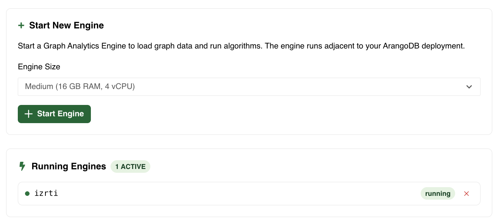
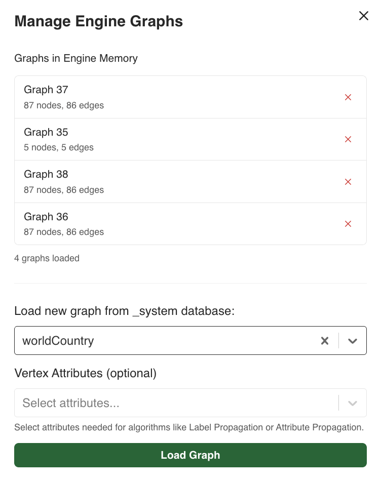

The Graph Analytics web interface in the Arango Data Platform provides a graphical
way to run graph algorithms on your data. You can start engines, load graphs into
memory, execute algorithms with custom parameters, and monitor job progress.

## The Graph Analytics workflow in the web interface

The typical workflow follows these steps:

1. **Engine Management**: Start a Graph Analytics Engine with the right size for your data.
2. **Graph Loading**: Load graph data from your database into the engine's memory.
3. **Algorithm Execution**: Run graph algorithms (PageRank, Connected Components, Label Propagation, etc.).
4. **Job Monitoring**: Track algorithm execution and view results in the Jobs History.

## How to access the Graph Analytics interface

1. From the left-hand sidebar, select the database you want to work with.
2. In the left-hand sidebar, click **AI Suite**, then click **Graph Analytics**.
3. The Graph Analytics Engine interface opens.

## Engine management

Before running any algorithms, you need to start a Graph Analytics Engine. The
**Running Engines** panel on the right side of the interface shows all active
engines with their unique engine IDs and current status.

### Start a new engine

1. In the right panel under **Running Engines**, click **Start New Engine**.
2. Select an **Engine Size** based on your graph data requirements:
   - **Small**: 1 GB RAM, 1 vCPU
   - **Medium**: 16 GB RAM, 4 vCPU
   - **Large**: 32 GB RAM, 8 vCPU
3. Click **Start Engine**.

The engine typically starts within a few seconds and appears in the
**Running Engines** list.

### Stop or remove an engine

To stop and remove an engine, click the icon next to it in the
**Running Engines** list.

You can have multiple engines running simultaneously, each maintaining its own
loaded graphs and job history. You can also unload a graph from an engine.

## Load graph data into engine memory

Before running algorithms, load the graph data from your database into the engine.
Follow these steps:

1. Ensure you have a running engine selected in the **Select Engine** dropdown menu.
2. In the **Select Graph** dropdown menu, click **Load New Graph**.
3. The **Manage Engine Graphs** dialog opens, showing:
   - **Graphs in Engine Memory**: Currently loaded graphs with their Graph ID,
    the number of nodes and edges.
   - **Load new graph from database**.
4. Select a graph from your database.
5. Optionally, select **Vertex Attributes** if your algorithm requires specific
   node attributes (e.g., for Label Propagation or Attribute Propagation).
6. Click **Load Graph**.

The load operation runs as a job. Once it is completed, the graph appears in
the engine memory list as loaded.

To remove a graph from memory and free up space, click the button next to it
in the **Manage Engine Graphs** dialog.


Load a graph once and reuse it for multiple algorithm runs. You only need to reload
if you want to include different attributes or if the source data has changed.


## Run algorithms

The **Algorithm Execution** section lets you configure and run graph algorithms.
Follow these steps:

1. **Select Engine**: Choose the active engine to use.
2. **Select Graph**: Pick a graph loaded in the engine's memory. The interface
  shows the graph name, the number of nodes and edges, and a **Ready to use** indicator.
3. **Select Algorithm**: Choose from the available algorithms.
4. Configure **Parameters**. These are specific to each algorithm.
5. Click **Run Algorithm**.

Each algorithm execution creates a job that you can monitor in the **Jobs History**.
See the complete list of [available algorithms in Graph Analytics](_index.md#available-algorithms).

### Available algorithms

Graph Analytics supports multiple algorithms for various analysis tasks:

- **PageRank**: Node importance ranking
- **Weakly Connected Components (WCC)**: Find groups connected by any path
- **Strongly Connected Components (SCC)**: Find groups with directed cycles
- **Betweenness Centrality**: Identify key connectors and bridges
- **LineRank**: Edge importance ranking
- **Label Propagation**: Fast community detection
- **Attribute Propagation**: Label accumulation and tracking

For detailed descriptions, parameters, and use cases, see the
[Available Algorithms](_index.md#available-algorithms) overview or the
[HTTP API documentation](api.md#run-algorithms).

## Monitor jobs

Click **View Jobs History** in the top right to open a detailed view of all
algorithm executions.

The **Jobs History** table displays:

| Column | Description |
|--------|-------------|
| **Job ID** | Unique identifier for the operation |
| **Graph ID** | Which graph the algorithm ran on |
| **Algorithm** | The executed algorithm name |
| **Status** | Current state: `COMPLETED`, `RUNNING`, or `FAILED` |
| **Progress** | Completion percentage (0-100%) |
| **Duration** | Execution time |
| **Memory** | Peak memory usage during computation |
| **Actions** | Store results to collections or delete the job |

### Store results to collections

For completed jobs, you can store the algorithm results back to your ArangoDB collections:

1. Click the  icon in the **Actions** column.
2. Specify the target collection and attribute name where results should be stored.
3. The results are written back to the collection.

You can also use the [Store Results API](api.md#store-job-results) to
programmatically write results with custom configuration such as setting
the degree of `parallelism` and the `batch_size` for saving the data.

## Best practices

### Choosing the right engine size

| Graph Size | Recommended Engine |
|------------|-------------------|
| Small (<10k nodes) | Small (1 GB RAM) |
| Medium (10k-1M nodes) | Medium (16 GB RAM) |
| Large (>1M nodes) | Large (32 GB RAM) |

Always account for both graph data and computation results when selecting engine size.

### Efficient graph loading

- Load graphs once and reuse them for multiple algorithm runs.
- Remove unused graphs to free memory.
- Select only necessary vertex attributes to reduce memory usage.
- For large graphs, test on a subgraph first to estimate resource requirements.

For more detailed troubleshooting and advanced configuration, see the
[HTTP API documentation](api.md).