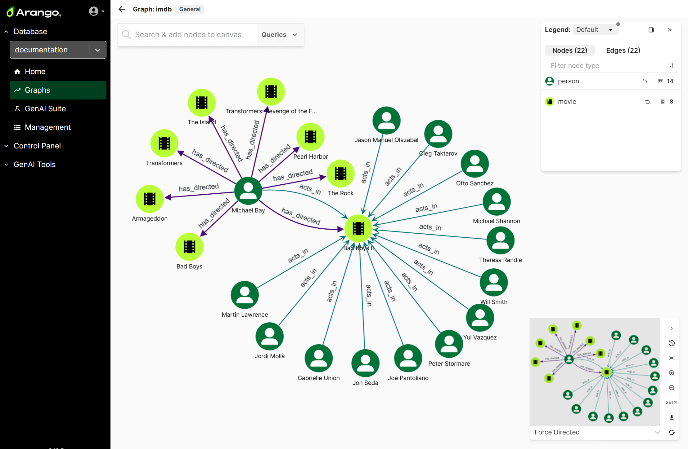


The Arango Data Platform & AI Services are available as a pre-release. To get
exclusive early access, [get in touch](https://arangodb.com/contact/) with
the ArangoDB team.


The **Graph Visualizer** is a browser-based tool integrated into the web interface
of the Arango Data Platform. It lets you explore the connections of your named graphs
to visually understand the structure as well as to inspect and edit the attributes
of individual nodes and edges. It also offers query capabilities and you can
create new nodes (vertices) and edges (relations).



You can use the Graph Visualizer to do the following:

- Select and view specific nodes including with custom queries to focus on a
  subset of your graph.
- Dynamically expand nodes to show more of their neighborhood to see how
  entities are connected.
- Inspect the properties of nodes and edges.
- Modify existing or create new nodes and edges.
- Rearrange nodes automatically or manually as well as assign colors and icons
  for better visual clarity.


Graph creation is **not** performed within the Graph Visualizer. Graphs must be
created in the **Management** section under **Graphs** of the second-level
navigation in the [web interface](../arangodb/3.12/components/web-interface/graphs.md). Once
created, you can select a graph from the list for exploration and visualization.


## View a graph

The core function of the Graph Visualizer is to provide an intuitive canvas for
exploring graph structures. You can visualize any type of **named graph**
(General Graphs, SmartGraphs, EnterpriseGraphs, SatelliteGraphs).


Anonymous graphs using adhoc sets of document and edge collections are not
supported by the Graph Visualizer.


### Select and load a graph

1. In the Arango Data Platform web interface, select the database your
   named graph is stored in.
2. Click **Graphs** in the main navigation.
3. Select a graph from the list.
4. The viewport of the Graph Visualizer opens for exploring the graph.

When you open a graph for the first time or previously used the **Clear graph**
option, the Graph Visualizer automatically populates the canvas with an initial
neighborhood. You can right-click the canvas and choose **Clear Canvas** to start
with an empty canvas.

You can [Add nodes to the canvas manually](#add-nodes-to-the-canvas-manually)
as well as [Add nodes and edges using a query](#add-nodes-and-edges-using-a-query).
Afterwards, you can also [Add nodes and edges using a query based on a selection](#add-nodes-and-edges-using-a-query-based-on-a-selection-canvas-actions)
as well as [Remove nodes from the canvas](#remove-nodes-from-the-canvas).

For each graph, the Graph Visualizer remembers the nodes and edges that are on
the canvas across sessions using the local browser storage. It also remembers
the theme settings including unsaved visual customizations, but not the specific
spatial arrangement of the nodes.

### The viewport

The Graph Visualizer interface is comprised of the following components:

- **Top bar**: The name and type of the graph, as well as a button to get
  back to the list of named graphs.
- **Canvas**: The main area of the viewport.
- **Search & add nodes to canvas** and **Queries**:
  A widget in the top left corner that opens dialogs for selecting nodes and
  edges to display (manually or using queries).
- [**Legend**](#legend-and-visual-customization):
  A panel on the right-hand side that shows you what colors and icons are used
  for nodes and edges, as well as to adjust the styling, and to select all
  items of a type.
- [**Layout and Navigation**](#layouts-and-navigation-tools):
  A minimap and multiple tools for the canvas in the bottom right corner.

### Add nodes to the canvas manually

You can add individual nodes to the canvas in addition to what is already
displayed.

1. Click **Search & add nodes to canvas**.
2. Select a **Node type**. This is the name of the collection that stores the
   nodes you want to select.
3. Enter a value into the **Search** field. This searches for document IDs
<!-- TODO: Will this come back?
This searches common attributes as indicated by the placeholder text and finds
up to 10 nodes that contain this text in one of these attributes
-->and finds up to 10 nodes that contain this text (case-insensitive).
4. Select one or more nodes from the list on the left-hand side.
5. Optional: You can inspect the attributes of the selected nodes on the
   right-hand side. Use the buttons at the bottom
   (, ) to switch between nodes.
6. Click **Add # nodes**.
7. To see the neighbor nodes and the edges that connect them, right-click a node,
   click **Expand (#)** and then **All (#)**.


### Add nodes and edges using a query

You can run an AQL query to add nodes, edges, or paths of the graph to the canvas.

1. Click **Queries** of the top-left widget.
2. On the **Queries** tab, click **New query**.
3. Enter an AQL query that returns nodes, edges, or paths
   (e.g. a graph traversal query), for example:
   ```aql
   FOR node IN coll LIMIT 10 RETURN node  // [ { "_id": "..." }, ... ]
   ```
   ```aql
   FOR edge IN edgeColl FILTER edge.value > 10 RETURN edge  // [ { "_from": "...", "_to": "...", "_id": "..." }, ... ]
   ```
   ```aql
   FOR v, e, p IN 1..3 ANY "coll/753" GRAPH "myGraph" RETURN p  // [ { "vertices": [...], "edges": [...] }, ... ]
   ```
4. Click **Run query**. Depending on what the query returns, either only nodes
   or edges with their nodes appear on the canvas, in addition to what is
   already displayed.


You can save queries for future use: 

1. Click **Queries** of the top-left widget.
2. On the **Queries** tab, click **New query**.
3. Enter or edit the AQL query you want to save. You can optionally use
   bind variables (like `@var`, `@@coll`) to parameterize saved queries.
4. Enter a name and optionally a description, then click **Save**.
5. To run a saved query, click **Queries** of the top-left widget.
6. Select a query from the list. The following actions are available for each query:
  - Copy () the query string to the clipboard.
  - **Bind Variables** to set for the query.
  - Edit () the query.
  - Delete () a no longer needed query.
  - Run () the query.



### Add nodes and edges using a query based on a selection (Canvas Actions)

**Canvas Actions** are stored AQL queries that work with your current selection
of nodes and edges on the canvas. Think of them as tools that let you discover
related data for what you have selected. Unlike regular queries that work on the
entire graph, Canvas Actions use special bind variables (`@nodes` and `@edges`)
in their AQL query to reference your selected items, making them context-aware
and interactive.

You can select nodes, edges, or both on the canvas and then use a **Canvas Action**.
This runs an AQL query to add nodes, edges, or paths of the graph to the canvas.
For example, you could select a movie and use a Canvas Action that adds all
other movies with the same runtime as the one you selected. Or you could select
two persons and use a Canvas Action to add all movies and persons that are on
the shortest paths between the selected persons.

The query of a Canvas Action has access to the current selection via the
`@nodes` and `@edges` bind variables. Both are arrays with the document IDs of
the currently selected nodes respectively edges.

1. Create a selection. You have different options:
   - Click a node or edge to select only this element.
   - Hold the  or  key and click multiple nodes and edges.
   - Hold the  or  key and drag the mouse to perform a box selection.
2. Right-click the canvas, click **Canvas Action**, and select a saved action.
3. Depending on the query, additional nodes or edges with their nodes are added
   to the canvas.
4. To create a custom Canvas Action query, click **Queries** of the top-left widget.
5. Go to the **Canvas actions** tab and click **New action**.
6. Enter an AQL query that makes use of the special bind variable `@nodes`,
   `@edges`, or both and returns nodes, edges, or paths. For example, iterate
   over the document IDs of the selected nodes, perform a graph traversal for
   each node, filter and limit the results, and add all of the items on the path
   to the canvas:
   ```aql
   FOR selectedNode IN @nodes
     FOR v, e, p IN 1..3 ANY selectedNode GRAPH "myGraph"
     FILTER p.edges[*].value ALL < 7
     LIMIT 20
     RETURN p
   ```
7. Enter a name and optionally a description for the action and click **Save**.


### Explore connections

You can explore the connections between entities of your graph in the following
ways:

- **Expand a node**: Right-click a node, then click **Expand (#)** and **All (#)**.
  This adds the direct neighbor nodes as well as the connecting edges to the canvas.

- **Shortest Path**: Select exactly two nodes, right-click one of them, and click
  **Shortest Path**. If there is a path between both nodes, the nodes and edges
  of one shortest path between them are added to the canvas.

- [**Queries**](#add-nodes-and-edges-using-a-query) and
  [**Canvas Actions**](#add-nodes-and-edges-using-a-query-based-on-a-selection-canvas-actions):
  You can run AQL graph queries (also based on the selection) to add connected
  nodes to the canvas. For example, you can use traversals to expand multiple
  levels of a node at once, or use path searches like `ALL_SHORTEST_PATHS`.
  This can be selective if you use `FILTER` operations.

### Remove nodes from the canvas

You can dismiss nodes to show less nodes and edges on the canvas to focus on the
relevant parts of the graph at a given time. This only changes what is displayed
on the canvas. It doesn't delete the underlying documents and you can add the
dismissed nodes and their edges back to the canvas later on.

1. Decide which nodes you want to either dismiss or keep. You can select nodes
   in different ways:
   - Right-click a single node to select only this node.
   - Hold the  or  key and click multiple nodes or drag the
     mouse to perform a box selection, then right-click one of the selected nodes.
2. In the context menu, click **Dismiss # nodes** to hide the selected nodes,
   or click **Dismiss other nodes** to only keep the selection.
3. The canvas updates to only display the remaining nodes, with no dangling edges.

### View node and edge properties

You can inspect (and edit) the document attributes of a node or edge via a
properties dialog that you can open as follows:

- Double-click a node or edge.
- Right-click a node to open the context menu and click **View node**.
- Right-click an edge to open the context menu and click **View edge**.


### Layouts and navigation tools

These features located in the bottom right of the viewport allow you to clear,
zoom, and pan the canvas, as well as rearrange the displayed graph data for a
better spatial understanding of node clusters, hierarchies, and relationship
flows. You can also download an image of what is displayed.

- **Minimap**: A small overview for easier canvas navigation.
  You can optionally hide it ().

- **Clear graph**: Remove all nodes and edges from the canvas ().
  This only affects what is displayed and does not delete the underlying documents.

- **Fit to Screen**: Resize and center the canvas so you can see everything
  ().

- **Zoom Controls**: Zoom in (), zoom out
  (), or reset the zoom to 100%.

- **Download screenshot**: Save a PNG image of what is currently displayed on
  the canvas ().

- **Re-run Layout**: Automatically rearrange the nodes using the selected
  algorithm ().

- **Layout Algorithms**: Choose between different ways of arranging the nodes.
  Which algorithm to use depends on the situation and the graph topology.

  You can also move nodes around manually by clicking and dragging them on the
  canvas.

## Edit graph data

While the Graph Visualizer is primarily designed for exploring graph data, you
can also create and modify nodes and edges directly from the canvas.

You need to have write access for the database and the collections for this.

### Create new nodes

You can add nodes to the graph's document collections directly from the
canvas. This allows you to create additional entities to the graph.

1. In the **Graphs** section of the Arango Data Platform web interface,
   select your graph.
2. Right-click the canvas, **Create node**, and choose a node collection to
   store the new node in.
3. A dialog opens with the following options:
   - Select the vertex collection (**Node Type**).
   - Optionally specify a unique identifier (**Node ID**).
   - Optionally provide a JSON body to use as the document content.
4. Click **Create** to add the node to the canvas and database.

### Create new edges

You can add edges to the graph's edge collections directly from the canvas.
This allows you to create additional connections between nodes.

1. In the **Graphs** section of the Arango Data Platform web interface,
   select your graph.
2. Right-click the canvas, **Create edge**, and choose an edge collection to
   store the new edge in.
3. A dialog opens with the following options:
   - Select the edge collection (**Edge Type**).
   - Set the **From** and **To** fields by selecting the source and target nodes.
   - Optionally specify a unique identifier (**Edge ID**).
   - Optionally provide a JSON body to use as the document content.
4. Click **Create** to add the edge to the canvas and database.


If you select two nodes before right-clicking the canvas and opening the edge
creation dialog, the **From** and **To** fields are automatically pre-filled.
You may need to swap the IDs () as the order is not based on
your selection sequence.



### Edit node and edge properties

You can modify the document attributes of nodes and edges from the canvas as follows:

1. Double-click a node or edge.
2. In the properties dialog that opens, click **Edit**.
3. You can switch between a **Form** and **JSON** editing mode.
4. Change or delete () existing properties.
5. In the **Form** mode, you can add new properties by scrolling to the bottom
   and clicking **Add Property**.
6. Click **Save** to store the changes, or **Cancel** to abort. <!-- TODO: Can't change system attributes, even though _from and _to are generally mutable -->

### Delete nodes

You can delete individual nodes which deletes the corresponding document.

1. Right-click a node to open the context menu.
2. Click **Delete Node**.
3. Any edges connected to this node are deleted by default to ensure graph
   consistency. To keep the edges, untick **Delete connected edge(s)**.
4. Confirm the deletion by clicking **Delete**.

### Delete edges

1. Right-click an edge to open the context menu.
2. Click **Delete Edge**.
3. Confirm the deletion by clicking **Delete**.

## Legend and visual customization

The legend panel lists the collections of the nodes and edges that are currently
on the canvas, how many there are of each type, and you can select all elements
of a type.

It also lets you adjust how the graph data is displayed, like the colors and
labels. You can create and select different themes for these visual
customizations. All styling changes are visual-only and do not affect the
underlying data.

### Customize the appearance of nodes

1. Click the **Legend** button in the top right to open the **Legend** panel
   if it's closed.
2. Select the **Nodes (#)** tab and click one of the node collections.
   You can filter by name if there are many.
3. You have the following theming options for nodes:
   - **Color**: Select a fill color for the circles that depict nodes.
     This lets you distinguish between different types of nodes at a glance.
   - **Icon**: Select a pictogram to be drawn inside the circles that resembles
     the kind of entity you store in a node collection. This allows you to
     quickly tell what type of node you look at.
   - **Display**: Select what attribute to use for the **Label** that is shown
     below a node, and what information to show in the tooltip when hovering
     over a node (**Hover info**). These options let you view a part of the
     node properties more quickly without opening the full
     [properties dialog](#view-node-and-edge-properties).


### Customize the appearance of edges

1. Click the **Legend** button in the top right to open the **Legend** panel
   if it's closed.
2. Select the **Edges (#)** tab and click one of the edge collections.
   You can filter by name if there are many.
3. You have the following theming options for edges:
   - **Color**: Select a stroke color for the lines that depict edges.
     This lets you distinguish between different types of edges at a glance.
   - **Line Style**: Adjust the stroke **Thickness** and the arrowheads of lines
     (**Source arrow** and **Target arrow**). These options let you customize
     how prominent edges are drawn and let you better tell different types of
     edges apart, especially when the label is not visible.
   - **Label**: What attribute to use for the **Label** that is shown along an
     edge, and what information to show in the tooltip when hovering an edge
     (**Hover info**). These options let you view a part of the edge properties
     more quickly without opening the full [properties dialog](#view-node-and-edge-properties).

### Save and manage themes

Themes are stored settings for the node and edge appearance. They are stored
per graph. You can switch between multiple themes to highlight different
aspects of the graph data.

1. If the **Legend** panel is closed, click the **Legend** button in the
   top right corner.
2. Open the drop-down menu at the top of the **Legend** panel.
3. To save visual customizations as a new theme, click **Add new theme**.
4. Enter a **Name** and optionally a **Description**.
5. Leave **Start with** set to **Current theme** to use the current settings.
6. Click **Save**. After additional customizations, you can save the changes to
   the theme you created via the drop-down menu ().
7. You can revert unsaved customizations of a specific collection via the
   collection list or customization panel (), or revert all
   unsaved changes via the theme drop-down menu ().
8. To switch to a different theme, click its name in the theme drop-down menu.

### Select all nodes or edges of a type

1. Click the **Legend** button in the top right to open the **Legend** panel
   if it's closed.
2. Select the **Nodes (#)** or **Edges (#)** tab.
3. You can see the number of nodes and edges (per collection) that are on the canvas.
4. You can sort the collection list by the number instead of name by clicking the icon
   in the filter input field () and selecting **Count**.
5. Click the icon () next to the number to select all
   nodes or edges that belong to the respective collection. This clears any
   previous selection.
