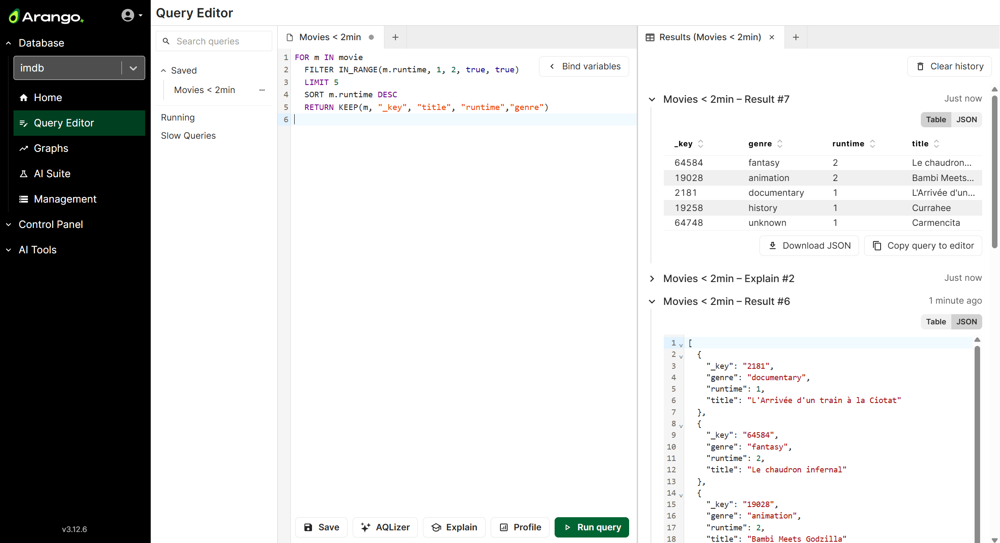
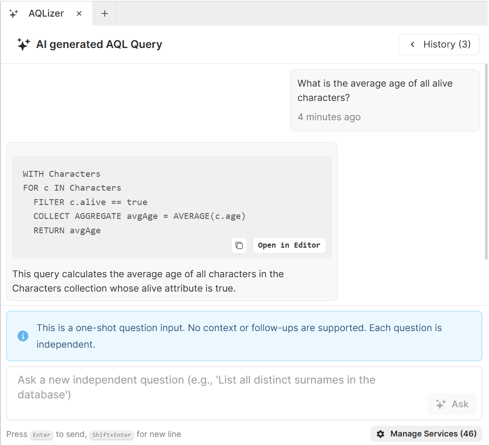

## Features

The Query Editor of the Arango Data Platform offers the following features:

- **Tabbed interface**:
  Work on multiple queries concurrently via tabs.

- **Query and results side by side**:
  View the results of running, explaining, and profiling a query in a separate
  tab, with one results tab for each query tab.

- **Result history**:
  A results tab shows the previous run, explain, and profile outputs.
  You can individually collapse and expand the entries, as well as clear the
  entire history.

- **Graph visualization**:
  Results of graph queries are shown by an embedded graph viewer to let you
  understand the topology. You can also switch to a JSON view mode.

- **Download results**:
  You can download the results of queries in JSON and CSV format.

- **Saved queries**:
  You can save frequently used queries to add them to a sidebar for all users
  in the current database.  

- **Remembered queries and results**:
  The Query Editor remembers its state including unsaved queries as well as
  results across sessions using your local browser storage.

- **Re-organizable viewport**:
  You can drag and drop tabs to re-order them and move them between existing
  panels, as well as split panels vertically and horizontally into more panels.

- **Bind variables and query options**:
  Bind variables in queries are detected automatically and you can parameterize
  them using a form or JSON mode. You can also specify options for the query
  in either of these modes.

- **Syntax highlighting**:
  AQL queries in the query editor are colorized for better readability.

- **Ask AI for AQL Queries (AQLizer)**:
  Describe what you want in natural language and generate AQL queries right
  from the Query Editor. This feature is only available in the
  Arango AI Data Platform.

## Work with queries

You can enter your AQL query code into the default tab, or open more query tabs
at any point by clicking the button at the top of a panel to the right of the
tabs ().

You can close tabs with the button next to the tab name ().
When you close all tabs, the viewport opens the **Welcome** tab.

There is a floating panel in the top right corner for **Bind variables & Options**.
You can minimize this panel to a button. The panel lets you enter values for
[bind variables](../arangodb/3.12/aql/fundamentals/bind-parameters.md) if there
are any such placeholders in the query (`@value`, `@@collection`). You can also
set query options here on the **Options** tab using a **Form** or **JSON** mode.

The following buttons are available at the bottom of a query tab:

- **Save**: Store the query and the bind variables under a name you provide.
  The saved queries of the current database are listed in the sidebar on the
  left-hand side under **Saved**, where you can also clone, rename, and delete them.
- **AQLizer**: This button is only visible if you use the AI Data Platform.
  See [Generate queries (AQLizer)](#generate-queries-aqlizer).
- **Explain**: Show the execution plan for the query.
- **Profile**: Run the query with detailed tracking of its performance.
- **Run query**: Execute the AQL query normally. You can also press
   respectively .

## Work with query results

When you run, explain, or profile a query, the results show up in a separate
tab than the query's tab. The query tab is typically on the left-hand side and
the results tab on the right-hand side in the viewport. This lets you view both
side-by-side, but you can [rearrange the tabs](#adjust-the-viewport) as desired.

Each pair of a query tab and a results tab is linked so that multiple executions
from a query tab have all the results listed in the corresponding results tab.

You can collapse () and remove ()
individual results, see the time of the execution, as well as clear the entire
result history.

For queries you ran, there are up to four different view modes for the results
that you can switch between:

- **Graph**: Show the results with an embedded graph viewer. Only available if
  the query returned edges or traversal paths.
- **Geo**: Display the results on a world map. Only available if the query
  returned GeoJSON Features or geometry (like `{"type":"Point","coordinates":[...]}`).
- **Table**: View the results in a tabular format where you can sort columns.
  Only available if most results have at least one common document attribute.
- **JSON**: View the results as text in the JavaScript Object Notation format.
  This mode is always available.

You have the following actions available for queries you ran: 

- **Open in Explorer**: Go to the Graph Visualizer and open the named graph
  used by the query. Only enabled if the query mentions a named graph
  (like `GRAPH "my-graph"`).
- **Download CSV**: Get a file with the results in the comma-separated values format.
- **Download JSON**: Get a file with the results in JSON format.
- **Copy query to editor**: Restore the query text and the bind variables of this
  query run in the corresponding query tab.

## Manage queries

The sidebar on the left-hand side allows you to manage queries:

- **Search queries**: Filter the list of **Saved** queries by name.
- **Saved**: Open previously saved queries by clicking the name, or click the
  small button () to duplicate, rename, or delete
  saved queries.
- **Running**: Open a tab with an overview over the currently executing queries.
  You can also kill queries in this view.
- **Slow Queries**: Open a tab with a list of past queries that ran longer than
  a server-configured threshold.

## Generate queries (AQLizer)



For an introduction to the AQLizer, see
[The AQLizer feature of the Arango Agentic AI Suite](../agentic-ai-suite/aqlizer.md).

Before you can generate AQL queries, you need to set up the AQLizer feature.

1. Click the **AQLizer** button to open the panel for generating AQL queries
   with AI.
2. On first use, you are asked for an **OpenAPI API Key** and you can select the
   desired **OpenAI Model**.
3. Click **Start Service**.
4. You can check the status of the service as well as stop it from the
   **Manage Services** dialog.

Once the AQLizer service is ready, you can generate queries.

1. In the AQLizer tab, enter a self-contained question or instructions in
   natural language, like "List all distinct surnames of characters older than 30".
2. Click **Ask** or press  to use GenAI for generating an AQL query.
3. Click **Open in Editor** for a new query tab, where you can verify, refine,
   and run the query.


Always verify AI-generated queries.
AI can make mistakes or produce unexpected results.


## Adjust the viewport

The following options for re-organizing how tabs and panels are arranged in the
Query Editor are available:

- You can drag a tab with your mouse to a different place in the tab list to
  change the order of the tabs or move a tab to a different panel.
- You can drag a tab to the left or right side of a panel to split it
  horizontally, or to the top or bottom to split it vertically.
  If you move or close the last remaining tab of panel elsewhere, the space is
  automatically reclaimed.
