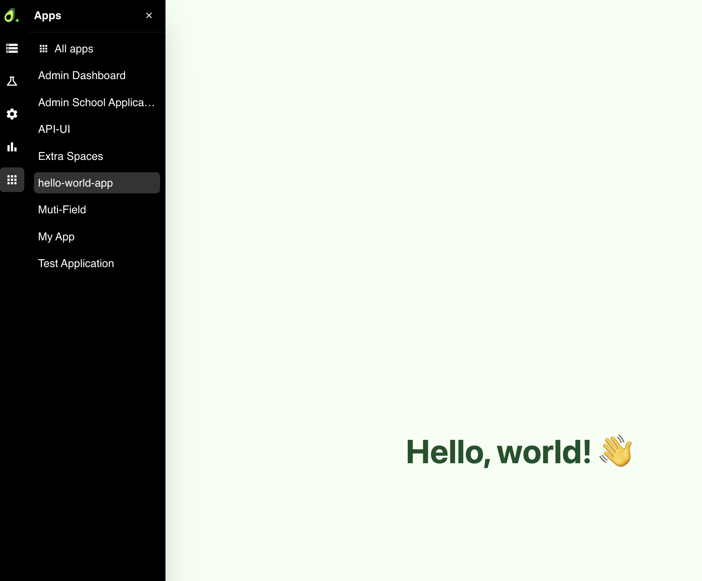

In addition to running headless services and APIs, the Container Manager can
host services that ship their own **user interface**. A service registered this
way becomes an **App**: it appears in the platform's **Apps** catalog and its UI
is rendered embedded in the Arango Platform web interface.

Apps are useful for surfacing custom dashboards, admin panels, and interactive
tools next to your data. This is also where you may find prototypes and
proof-of-concept demos, when enabled for you by ArangoDB.

An App is deployed exactly like any other code package or Docker image through
the [Container Manager](web-interface/). The only differences are that you
register the service as an App and that your service serves a UI.

## Requirements

A service is eligible to be an App as long as it **returns a UI (HTML) at the
root path (`/`)**: instead of (or in addition to) serving an API, the service
responds to requests at `/` with an HTML page.

Serving HTML at `/` is what makes a service eligible, but it is not the only
requirement. To actually register the service as an App, you also provide the
`has_ui`, `display_name`, and `description` metadata at deploy time (see
[Register a service as an App](#register-a-service-as-an-app)).

This applies to both deployment methods:

- **Bring Your Own Code**: Your code package serves HTML at `/`.
  See [Package Your Code](package-code/).
- **Bring Your Own Container**: Your Docker image exposes an HTTP server
  (default port `8000`) that serves HTML at `/`.

The platform routes the embedded app's traffic to your service's root path, so
no additional configuration is required beyond serving the page at `/`.


In the web interface, the embedded app is served under its own URL path, but
the platform forwards these requests to the root path (`/`) of your service.
To keep assets and API calls working under the app's URL path, serve the UI at
`/` and reference any assets and API endpoints using relative paths.


## Register a service as an App

You register a service as an App at deploy time in the Container Manager web
interface:

1. Open the **Container Manager** (**Control Panel** → **Container Manager**).
2. Fill in the **Deploy new Service** panel for your service:
   - On the **Packages** tab, upload your `.tar.gz` code package and set the
     file name, version, and base image.
   - On the **Containers** tab, enter your Docker image URL.

   For the full list of fields, see
   [Deploy Service from a Code Package](web-interface/#deploy-service-from-a-code-package)
   or [Deploy Service from a Docker Image](web-interface/#deploy-service-from-a-docker-image).
3. Enable **Register as App**.
4. Enter a **Display name** and a **Description**. These identify your app in
   the Apps catalog.
5. Click **Deploy Service** (or **Deploy Container**).

Once deployed, the service is listed with an **Apps** badge in the **Packages**
or **Containers** list, indicating that it is available in the Apps catalog.

To register a service as an App programmatically, see
[Deploy via API](deploy-api/#register-a-service-as-an-app).

## Open an App from the catalog

Once your App is running, you can open it from the Apps catalog:

1. In the Arango Platform web interface, open the **Apps** catalog.
2. Search for your app by its **Display name**.
3. Select the app to open it. Its UI is rendered embedded in the web interface.

