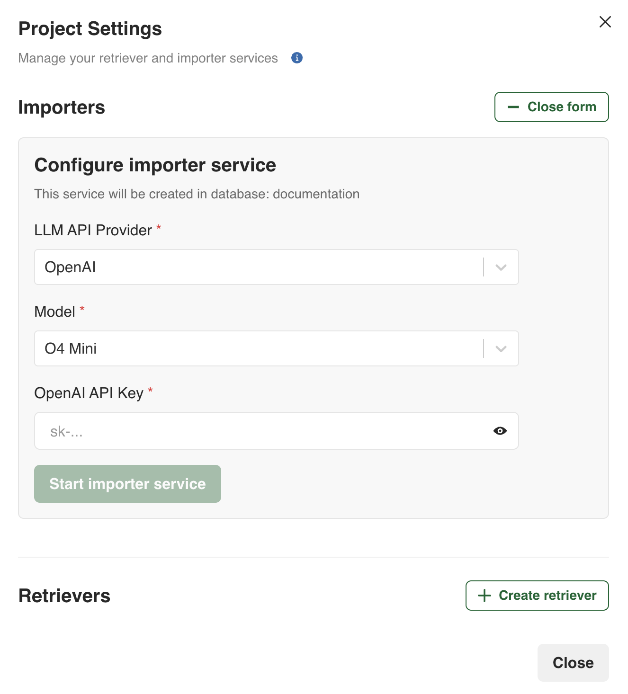
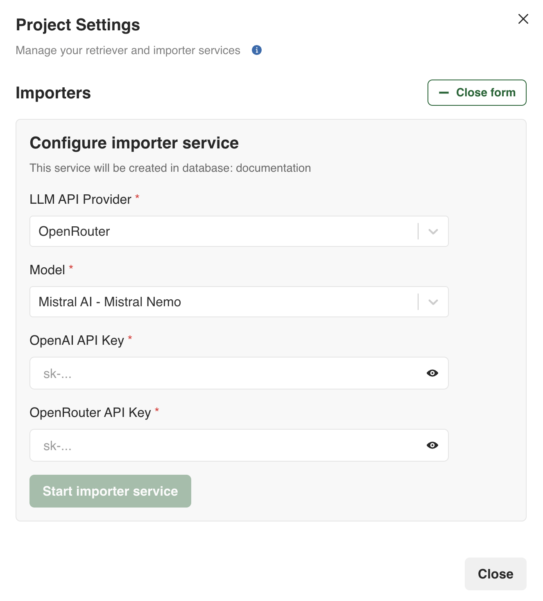
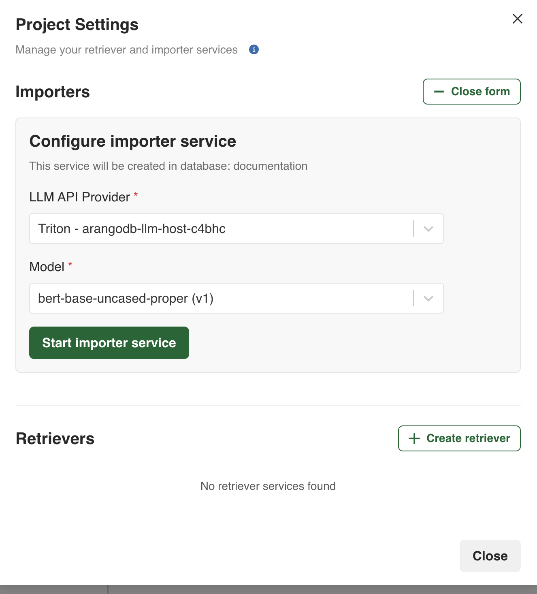
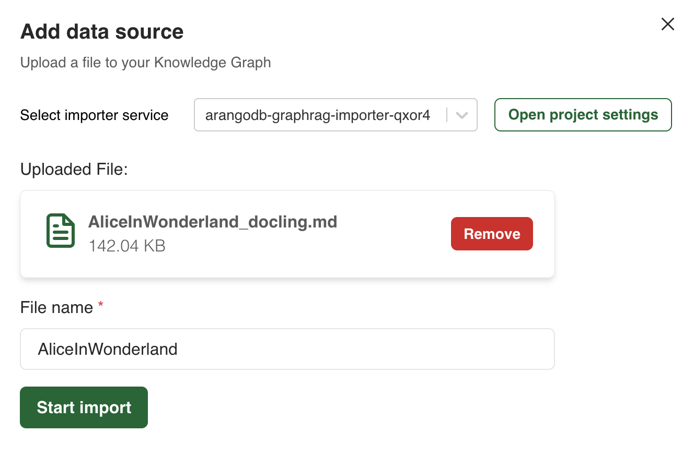
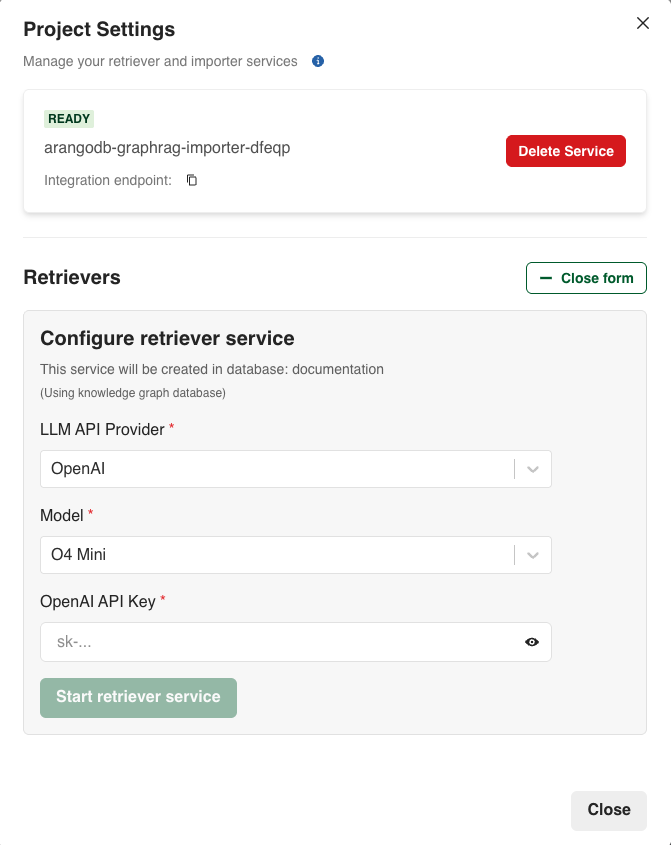
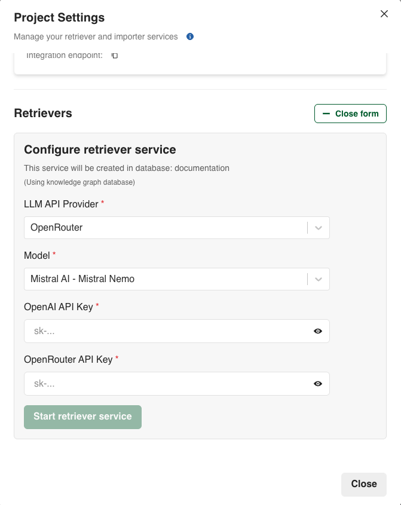
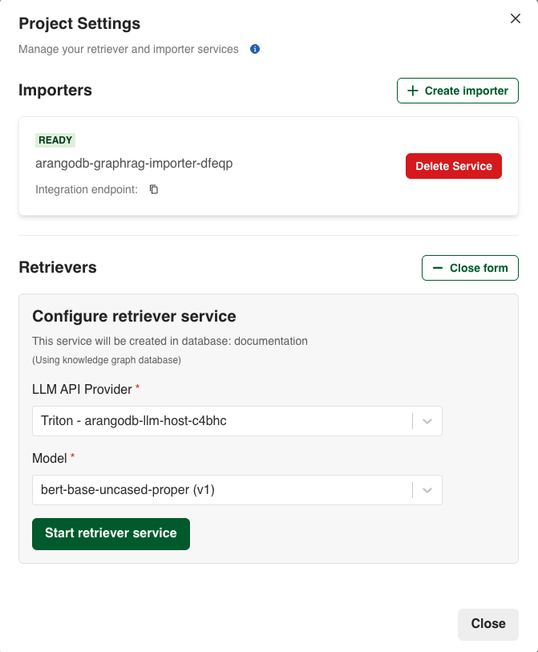
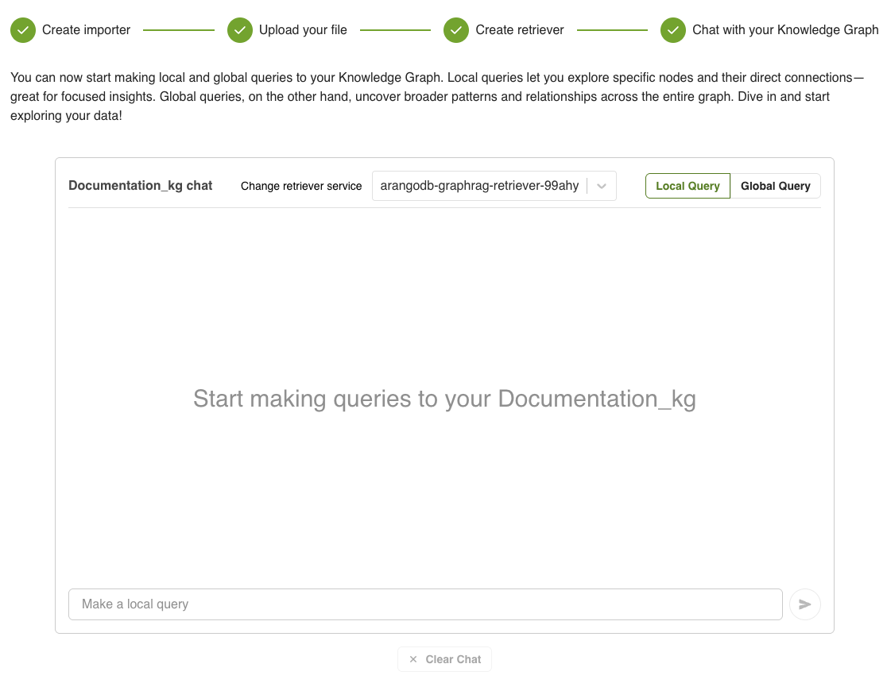




The ArangoDB Platform & GenAI Suite is available as a pre-release. To get
exclusive early access, [get in touch](https://arangodb.com/contact/) with
the ArangoDB team.


## The GraphRAG workflow in the web interface

The entire process is organized into sequential steps within a **Project**:

1. Creating the importer service
2. Uploading your file and exploring the generated Knowledge Graph
3. Creating the retriever service
4. Chatting with your Knowledge Graph

## Create a GraphRAG project

To create a new GraphRAG project using the ArangoDB Platform web interface, follow these steps:

1. From the left-hand sidebar, select the database where you want to create the project.
2. In the left-hand sidebar, click **GenAI Suite** to open the GraphRAG project management
   interface, then click **Run GraphRAG**.
3. In the **GraphRAG projects** view, click **Add new project**.
4. The **Create GraphRAG project** modal opens. Enter a **Name** and optionally
   a description for your project.
5. Click the **Create project** button to finalize the creation.

## Configure the Importer service

Configure a service to import, parse, and retrieve all the needed data from a
file. This service uses the LLM API provider and model of your choice.

After clicking on a project name, you are taken to a screen where you can
configure and start a new importer service job. Follow the steps below.




1. Select **OpenAI** from the **LLM API Provider** dropdown menu.
2. Select the model you want to use from the **Model** dropdown menu. By default,
   the service is using **O4 Mini**.
3. Enter your **OpenAI API Key**.
4. Click the **Start importer service** button.

 



1. Select **OpenRouter** from the **LLM API Provider** dropdown menu.
2. Select the model you want to use from the **Model** dropdown menu. By default,
   the service is using **Mistral AI - Mistral Nemo**.
1. Enter your **OpenAI API Key**.
2. Enter your **OpenRouter API Key**.
3. Click the **Start importer service** button.


When using the OpenRouter option, the LLM responses are served via OpenRouter
while OpenAI is used for the embedding model.





1. Select **Triton** from the **LLM API Provider** dropdown menu.
2. Select the Triton model you want to use from the **Model** dropdown menu.
3. Click the **Start importer service** button.


Note that you must first register your model in MLflow. The [Triton LLM Host](./services/triton-inference-server.md)
service automatically downloads and loads models from the MLflow registry.






See also the [GraphRAG Importer](./services/importer.md) service documentation.

## Upload your file

1. Upload a file by dragging and dropping it in the designated upload area.
   The importer service you previously launched parses and creates the
   Knowledge Graph automatically.
2. Enter a file name.
3. Click the **Start import** button.


You can only import a single file, either in `.md` or `.txt` format.


## Explore the Knowledge Graph

You can open and explore the Knowledge Graph that has been generated by clicking
on the **Explore in visualizer** button.

For more information, see the [Graph Visualizer](../../graph-intelligence/graph-visualizer.md) documentation.

## Configure the Retriever service

Creating the retriever service allows you to extract information from
the generated Knowledge Graph. Follow the steps below to configure the service.




1. Select **OpenAI** from the **LLM API Provider** dropdown menu.
2. Select the model you want to use from the **Model** dropdown menu. By default,
   the service uses **O4 Mini**.
3. Enter your **OpenAI API Key**.
4. Click the **Start retriever service** button.




1. Select **OpenRouter** from the **LLM API Provider** dropdown menu.
2. Select the model you want to use from the **Model** dropdown menu. By default,
   the service uses **Mistral AI - Mistral Nemo**.
3. Enter your **OpenRouter API Key**.
4. Click the **Start retriever service** button.


When using the OpenRouter option, the LLM responses are served via OpenRouter
while OpenAI is used for the embedding model.





1. Select **Triton** from the **LLM API Provider** dropdown menu.
2. Select the Triton model you want to use from the **Model** dropdown menu.
3. Click the **Start retriever service** button.


Note that you must first register your model in MLflow. The [Triton LLM Host](./services/triton-inference-server.md)
service automatically downloads and loads models from the MLflow registry.






See also the [GraphRAG Retriever](./services/retriever.md) documentation.

## Chat with your Knowledge Graph

The Retriever service provides two search methods:
- [Local search](./services/retriever.md#local-search): Local queries let you
  explore specific nodes and their direct connections.
- [Global search](./services/retriever.md#global-search): Global queries uncover
  broader patters and relationships across the entire Knowledge Graph.

In addition to querying the Knowledge Graph, the chat service allows you to do the following:
- Switch the search method from **Local Query** to **Global Query** and vice-versa
  directly in the chat
- Change the retriever service
- Clear the chat
- Integrate the Knowledge Graph chat service into your own applications
